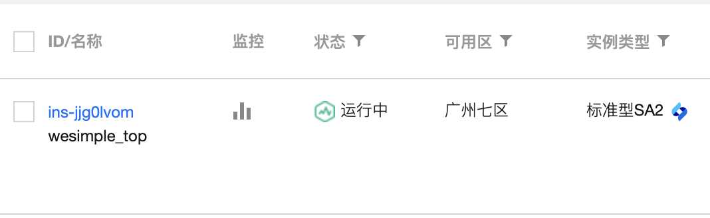
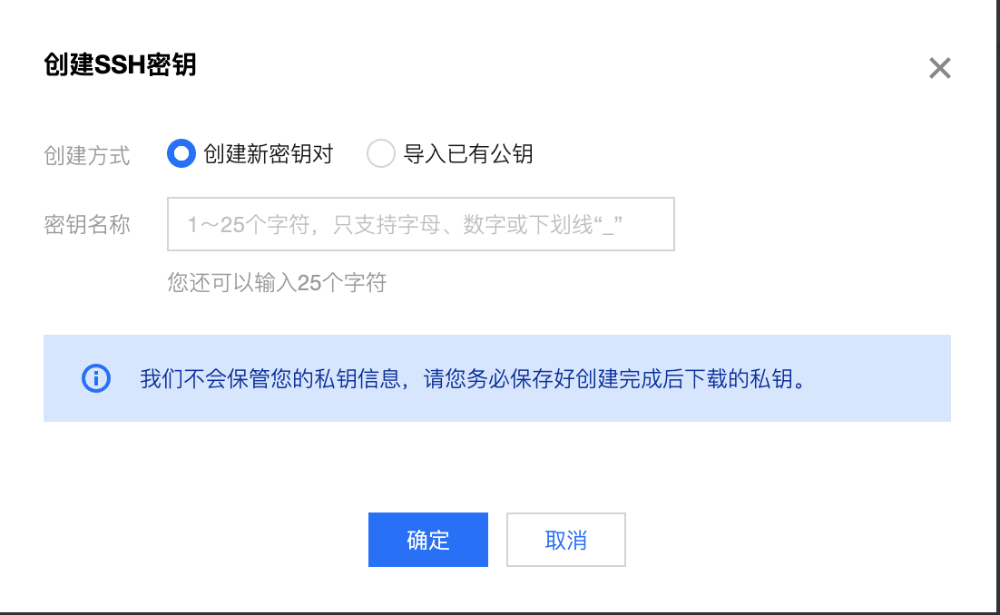
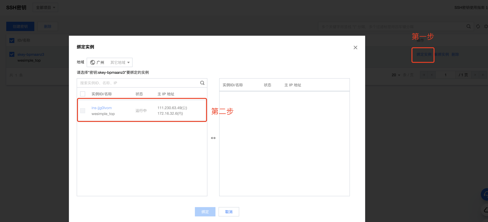
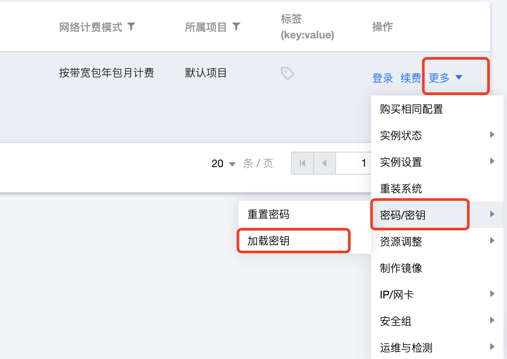
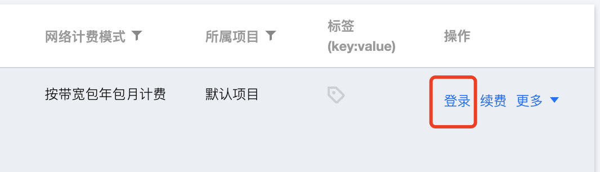
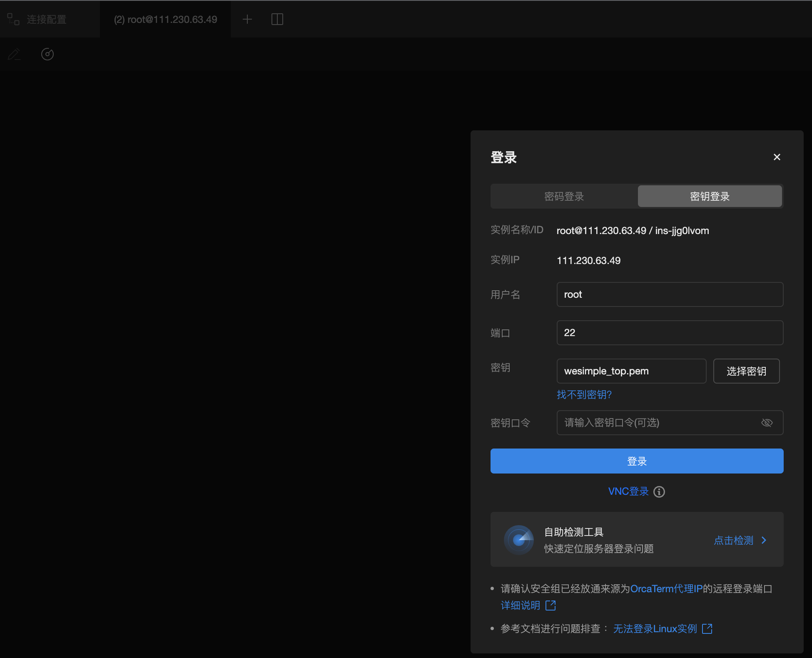

# 腾讯云服务器，Mac 环境 ssh 登录

[官方文档 - 使用 SSH 登录 Linux 实例](https://cloud.tencent.com/document/product/213/35700)

## 1. 首先得有一台云服务器



## 2. 创建 ssh 密钥

> 要注意的是，创建密钥后，就会触发下载，这个时候要保存下载的密钥（后缀是`.pem`）文件到本地。

[ssh 密钥管理](https://console.cloud.tencent.com/cvm/sshkey/index?rid=1&pid=-1)



## 3. 关联 ssh 密钥到 云服务器实例上

### 3.1 绑定入口一



### 3.2 绑定入口二



## 4. ssh 登录

### 4.1 管理台登录





每次都需要重新上传`ssh密钥`。

### 4.2 Mac 通过终端登录

```bash
chmod 400 <下载的与云服务器关联的私钥的绝对路径>
```

然后就可以用自带 `ssh` 工具登录了。

```bash
ssh -i <下载的与云服务器关联的私钥的绝对路径> <username>@<hostname or IP address>
```

如具体执行命令如下：

```bash
ssh -i "~/wesimple_top.pem" root@111.230.63.49
```
