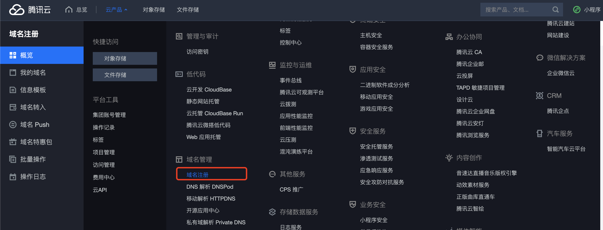
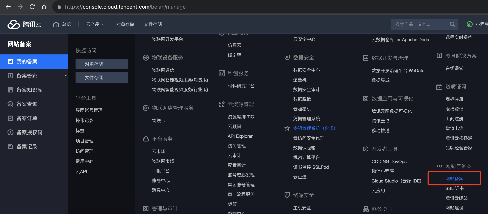

# 域名注册及域名备案

## 1. 域名注册

进入[域名注册](https://console.cloud.tencent.com/domain)页面：

1. 输入域名，验证是否被占用；
2. 购买对应的域名即可；

## 2. 域名备案

上一步域名购买完毕后，就可以进行[域名备案](https://console.cloud.tencent.com/beian/manage)流程了。

腾讯云备案，预计十个工作日左右，主要是`通信管理局`审核时间比较久。
