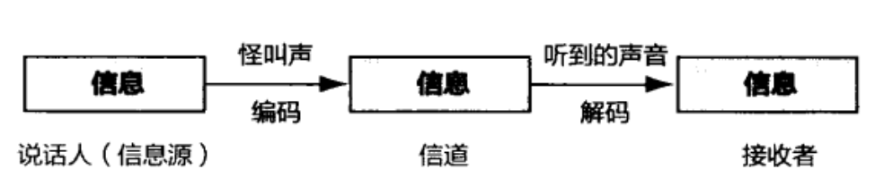
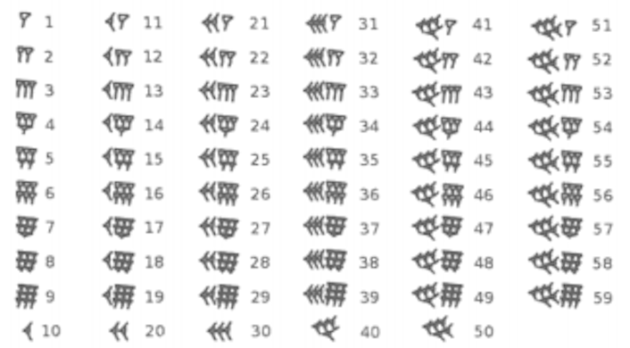
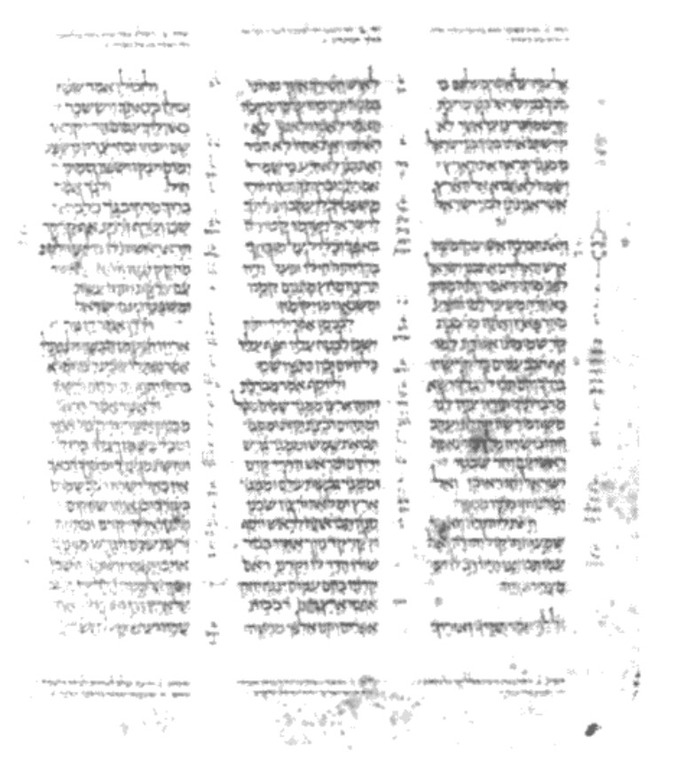

# 【数学之美】文字和语言 vs 数字和信息

## 0. 前言

数字、文字和自然语言一样，都是信息的载体，它们之间原本有着天然的联系。
语言和数学的产生都是为了同一个目的 —— 记录和传播信息。
但是把数学和信息系统自觉地联系起来是半个多世纪前香农博士发明信息论以后的事。

在此之前，数学的发展更多地和人类对自然的认识以及生产活动联系在一起，包括天文学、几何和工程学、经济学、力学、物理学甚至生物学等，而数学和语言学儿乎是没有交集的。
我们见到很多数学家同时是物理学家或者天文学家，但是过去很少有数学家同时是语言学家。

## 1. 信息

我们的相先“现代人”（人类学上的说法）在长成我们今天的模样以前，就开始使用和传播信息了。
正如动物园里的动物们经常发出它们喜欢的怪叫一样，早期的人类也喜欢发出含糊的声音。

虽然最初可能只是喜欢这样发声，浙浙地人们开始用这种声音来传播信息，比如用某种特定的声音表示“那里有只熊”，提醒同伴小心。同伴可能“呀呀”地回应两声，表示知道了，或者发出另一串含糊不清的声音，表示“我们用石头打它”。

这里面信息的产生、传播、接收和反馈，与今天最先进的通信在原理上没有任何差別。

早期人类了解和需要传播的信息是很少的，因此他们并不需要语音和数字。
但是随着人类的进步和文明化的进展，需要表达的信息也越来越多，不再是几种不同的声音就能完全覆盖，语言就此产生。

人们生活的经验，作为一种特定的信息，其实是那个时代最宝贵的财富，通过口述的语言传给了后代。
同时，由于人类开始拥有一些食物和物件，便有了多和少的概念。很遗饿，那时的人类还不会数数，因为他们不需要。

## 2. 文字和数字

我们的祖先迅速学习新鲜事物，语言也越来越丰富，越来越抽象。语言描述的共同因素，比如物体、数量、动作便抽象出来，形成了今天的词汇。

当语言和词汇多到一定程度的时候，人类仅靠大脑已经记不住所有词汇了。这就如同今天没有人能够记住人类所有的知识一样。
高效记录信息的需求就产生了，这便是文字的起源。

这里，我们需要回到我们祖先走出的大陆 —— 非洲，那用是人类文明的摇篮。

在中国（迄今发现的）最早的甲骨文（即大辛庄甲骨文）出现前的几千年，尼罗河流域就有了高度的文明。
古埃及人不仅是优秀的农夫和建筑师，他们还发明了最早的保存信息的方式 —— 用图形表示事物，这就是最早的象形文字（Hieroglyphic）。

在早期，象形文字的数量和记录一个文明需要的信息量显然是相关的。
最早刻有埃及象形文字的文物的年代大约是公元前 `32` 世纪，那个时期的象形文字数量大约只有 `500` 个，但是到了公元前 `5-7` 世纪（主要是`“希腊一罗马时代”，Greece-Roman Era`），埃及象形文字的数量增加到了 `5000` 个左右，这个规模和中国常用的汉字数量相当（以二级国际汉字库为准）。

然而随着文明的进步，信息量的增加，埃及的象形文字数量便不再随着文明的发展而增加了，因为没有人能够学会和记住这么多的文字。
于是，概念的第一次概括和归类就开始了。

在中国的象形文字中，“日”本意是太阳，但是它同时又是太阳从升起到落山再到升起的时间周期，也就是我们讲的 —— 天。
在古埃及的象形文字中，语音相同的词可能用同一个符号记录。这种概念的聚类，在原理上与今天自然语言处理或者机器学习的聚类有很大的相似性，只是在远古，完成这个过程的时间可能需要上千年；而今天，可能只需几天甚至几小时，视计第机的速度和数量而定。

文字按照意思来聚类，最终会带来一此歧义性，也就是说有时弄不清一个多义字在特定环境下它到底表示其中的哪个含义。
而解决这个问题的方法，过去的先生和今天的学者没有什么不同，都是依靠上下文。

有了上下文，大多数情况下多义字的去除歧义（Disambiguation）可以做到。
当然，总有个別做不到的时候，这就导致了学者们对某段话理解上的不同。
中国古代学者对儒家经典的注释和正义，其实都是在按照自己的理解做消除歧义性的工作。
今天的情况也类似，对上下文建立的概率模型再好，也有失灵的时候。

这些是语言从产生伊始就固有的特点。

有了文字，前人的生活经验和发生的事件便一代代传了下来。只要一个文明不中断，或者这种文字还有人认识，这些信息就会永远地传下去，比如中国的文明便是如此。当然，当一种文字不再有人认识时，破解相应的信息就有点困难了，虽然办法还是有的。

不同的文明，因为地域的原因，历史上相互隔绝，便会有不同的文字。随着文明的融合与冲突。不同文明下的人们需要进行交流，或者说通信，那么翻译的需求便产生了。

翻译这件事之所以能达成，仅仅是因为不同的文字系统在记录信息上的能力是等价的。（这个结论很重要。）
进一步讲，文字只是信息的载体，而非信息本身。那么不用文字，而用其他的载体（比如数字）是否可以存储同样意义的信息呢？
这个答案是肯定的，这也是我们今天现代通信的基础。

当然，不同的文明进行交流时，或许会用不同的文字记载同一件事情。这就有可能为我们破解无人能懂的语言提供一把钥匙。

既然文字是出现在远古“信息爆炸”导致人们的头脑装不下这些信息的时候，那么数字的出现则是在人们的财产多到需要数一数才搞清楚有多少的时候。
著名的美籍俄裔物理学家`乔治•伽莫夫（George Gamow, 1904-1968）`在他的科普读物 `《从一到无穷大》`一书中讲了这样一个原始部落中的故事。
两个`酋（读 qiú）`长要比一比谁说的数字大，一个酋长想了想，先说了“三”，第二个酋长想了半天，说你赢了。
因为在原始部落，物质极其缺乏，超过三的时候很少，他们就称之为“许多”或者叫数不清。
因此，在那个时代，不可能有完整的计数系統。

当我们的祖先需要记录的物件超过三时，当他们觉得五和八还是有区别的时候，计数系統就产生了。
而数字是计数系统的基础。

当然，早期数字并没有书写的形式，而是掰指头，这就是为什么我们今天使用十进倒的原因。
毫无疑问，如果我们有十二个指头，今天我们用的一定是十二进制。
而具有书写形式的数字和象形文字应该诞生子同一时期 —— 几乎所有早期的文明对于数字 `1`、`2`、`3` 的记录方式都是几横（中国）、几竖（罗
马）或者几个`楔（读 xiē）`子点（巴比伦）。这是典型的象形文字的特征。

因此，数字和其他文字一样，在早期只是承载信细息的工具，并不具有任何抽象的含义。

渐渐地，我们的祖先发现十个指头不够用了。虽然最简单的办法就是把十个脚趾头也算上，但是这不能解决根本问题。
我们的祖先很聪明，他们发明了进位制，也就是我们今天说的逢十进一。

这是人类在科学上的一大飞跃，因为我们的祖先懂得对数量开始编码了，不同的数字代表不同的量。

对于不同位数数字的表示，中国人和罗马人都用明确的单位来表示数字的不同量级，中国人是用个十百千万亿兆。
罗马人用 `I` 代表`个`，`V` 代表 `5`，`X` 代表 `10`，`L` 代表 `50`，`C` 代表 `100`，`D` 代表 `500`，`M` 代表 `1000`，再往上就没有了。
这两种表示法都不自觉地引人了朴素的编码的概念。

首先，它们都是用不同的符号代表不同的数字概念；第二，它们分别制定了解码的规则。

在中国，解码的规则是乘法。`200` 万的写法含义是 `2 × 100 × 10000`；
而在罗马，解码的规则是加减法 —— 小数字出现在大数字左边为减，右边为加。比如 `IV` 表示 `5-1=4`，`VII` 表示 `5+2=7`, `IIXX` 表示 `20-2=18`。
这个规则不仅复杂，而且对于大的数字很难描述。罗马人要写 `100 万`的话，恐怕要 `MMMM...` 地不断写下去，写满一整块黑板，直到近代他们才在 `M` 上用`上划线`表示`几万`和`几十万`。

因此，从编码的有效性来讲，中国人的做法比罗马人高明。实际上，罗马人的老师希腊人的计数方式和中国古代颇为相似，不知为什么，罗马人没学会。

描述数字最有效的是古印度人，他们发明了包括 `0`（这个 `0` 很重要，否则就需要许多描述进制的量词，如个十百千万等）在内的 `10` 个阿拉伯数字，就是今天全世界通用的数字。

这种表示方法比中国和罗马的都抽象，但是使用方便。因此，它们由阿拉伯人传入欧洲后，马上得到普及。
只是欧洲人并不知道这些数字的真正发明者是印度人，而把功劳给了“二道贩子”阿拉伯人。

阿拉伯数字或者说印度数字的革命性不仅在于它的简洁有效，而且标志着数字和文字的分离。
这在客观上让自然语言的研究和数学在几千年里没有重复的轨迹，而且越走越远。

## 3. 文宇和语言背后的数学

但是，任何事物的规律性是内在的，并不随它的裁体而改变。
自然语言的发展在冥冥之中，都受者信息科学規律的引导。

当人类第二个文明的中心古巴比伦在两河流城的美索不达米亚建立的时候，一种新的文字 —— 楔形文字诞生了。
考古学家和语言学家最初看到这些刻在泥板和石板上，与埃及象形文字多少有点相像的符号时，以为它们是另一种象形文字。
但是很快他们就发现这些文字其实是拼音文字，是我们这个星球上最古老的拼音文字，每个形状不同的楔子实际上是一个不同的字母。如果把中文的笔画作为字母，它其实也是一种拼音文字，不过它是二维的而已。（不过，为了和罗马体系的拼音文字相区别，在这里我们会把汉字称为意型文字。）

大英博物馆保存了上万块这种泥板和石板，上面都是楔形文字。这些刻满了文字的石板和泥板与亚述浮雞一起，被认为是最有价值的古巴比伦文物。

拼音文字由腓尼基人从以古巴比伦为中心的美索不达米亚带到地中海东岸的叙利亚。腓尼基人是天生的商人，不愿意把大量的时间花在雕刻这些漂亮的楔形字母上，而将它们简化成 `22` 个字母。这些字母随着腓尼基人的商团经爱琴海诸岛（如克里特岛），然后传给了希腊人的祖先。但是，拼音文字在古希腊得到了充分的发展，和古巴比伦的楔形字母已经不同，古希腊文字母的拼写和读音已经紧密地结合起来了，这种语言相对容易学习。

在今后的几个世纪里，伴随者马其顿人以及几个世纪后的罗马人的扩张，这些只需要几十个字母的语言成为了欧亚非大陆语言体系的主体，因此．今天我们把所有西方的拼音文字称为`罗马式的语言（Roman Languages)`。

从象形文字到拼音文字是一个飞跃，因为人类在描达物体的方式上，从物体的外表到抽象的概念，同时不自觉地采用了对信息的编码。不仅如此，我们的祖先对文字的编码还非常合理。在罗马体系的文字中，总体来讲，常用字短，生僻字长。而在意型文字中，也是类似，大多常用字笔画少，而生僻字笔画多。

这完全符合信息论中的最短编码原理，虽然我们的祖先并不懂信息论。这种文字设计（其实是一种编码方法）带来的好处是书写起来省时间、省材料。

在蔡伦发明纸张以前，书写文字不是一件容易的事情。就以中文为例，在东汉以前要将文字刻在其他物件比如龟壳、石碑和竹简上。由于刻一个字的时间相当长，因此要惜墨如金。
这就使得我们的古文（书面文学）非常简洁，但是非常难懂，而同时期的口语却和今天的白话差别不大，语句较长但是易懂。（岭南客家话基本上保留了古代口语的原貌，写出来和我们清末民初的白话颇为相似。）

这种现象非常符合今天信息科学（和工程）的一些基本原理，就是在通信时，如果信道较宽，信息不必压缩就可以直接传递；而如果信道很窄，信息在传递前需要尽可能地压缩，然后在接收端进行解压缩。
在古代，两个人讲话说得快是一个宽信道，无需压缩：书写来得慢是一个窄信道，需要压缩。
将日常的白话口语写成精简的文言文本身是信道压缩的过程，而将文言文解释清楚是解压缩的过程。
这个现象与我们今天宽带互联网和无线 `WAP` 互联网网页的设计完全一致，前者是经过一个宽带传输，因此页面设计得较大；而后者由于空中频道带宽的限制，传输速度要慢一到两个数量级，因此 `WAP` 页面都非常小。
由此可见，在信息论尚未被发明的几千年前，中国人己经无意识地遵照它的规律行事了。

当司马迁用`近 53 万字`记载了中国上千年历史的同时，远在中东的犹太人也用类似的篇幅记载了自创世纪以来，主要是摩西以来他们祖先的历史，这就是《圣经》中的《旧约》部分。《圣经》简洁的文风和中国的《史记》颇有相似之处。但是和《史记》这本由唯一作者写成的史书不同，《圣经》的写作持续了很多世纪，后世的人在做补充时，看到的是几百年前甚至上千年前原作的抄本。抄写的错误便在所难免。

虽然做事认真的犹太人要求在抄写《圣经》时，要虔诚井且打起十二分精神，但是抄写错误还是难以避免。

于是犹太人发明了一种类似于我们今天计算机和通信中校验码的方法。他们把每一个希伯来字母对应于一个数字，这样每行文字加起来便得到一个特殊的数字，这个数字便成为了这一行的校验码。同样，对于每一列也是这样处理。当犹太学者抄完一页《圣经》时，他们需要把每一行的文字加起来．看看新的校验码是否和原文的相同，然后对每一页进行同样的处理。如果这一页每一行和每一列的校验码和原文完全相同，说明这一页的抄写无误。

如果某行的校验码和原文中的对应不上，则说明这行至少有一个抄写错误。当然，错误对应列的校物码也一定和原文对不上，这样可以很快找到出错的地方。这背后的原理和我们今天的各种校验是相同的。

语言从古语发展到现代语言，在表达含义上比以前更准确、更丰富，这里面语法起到了很大的作用。
如果说从字母到词的`构词法（Morphology）`是词的编码规则，那么语法则是语言的编码和解码规则。
不过，相比较而育，词可以被认为是有限而且封闭的集合，而语言则是无限和开放的集合。

从数学上讲，对于前者可以有完备的编解码规则，而后者则不具备这个特性。因此，任何语言都有语法规则覆盖不到的地方，这些例外或者说不精确性，让我们的语言丰富多彩。虽然正统而教条的语育学家倾向于把这些例外作为“病句”，并且有的人毕其一生的精力来消灭病句，纯化语言，但是事实证明这种工作是徒劳的。莎士比亚的作品在他的时代完全是通俗而大众化的，其中包括大量和古语法相违背的名句，那个时代就开始有人试图完善（其实是篡改）莎士比亚剧。可今天这些语言不但没有消失反而成了经典，而试图完善他的著作的人却早已为大众遗忘。

## 4. 参考

- 吴军博士`《数学之美》`节选自`《文字和语言 vs 数字和信息》`章节。
