# 前端项目负责人在项目初期需要做什么

## 1. 前言

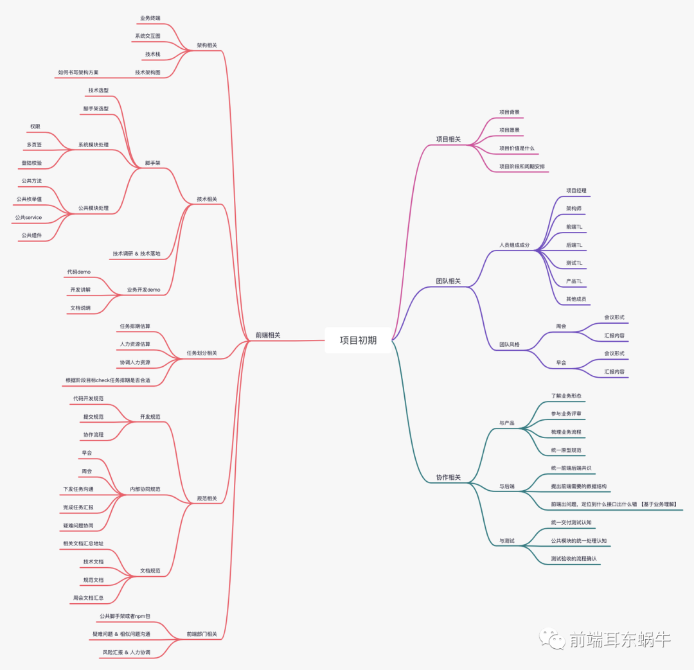

主要分四个方面：

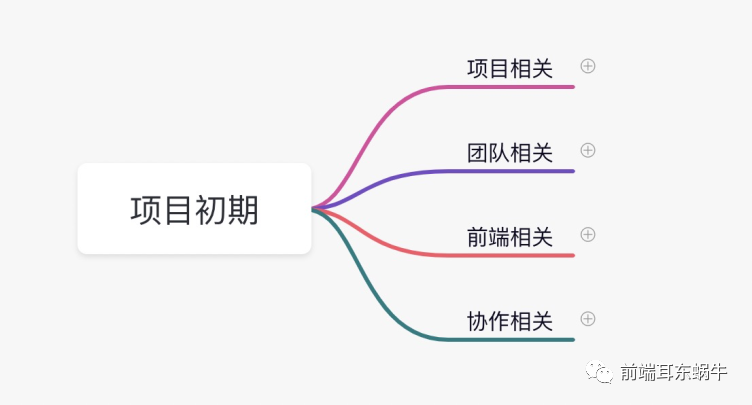

## 2. 项目相关

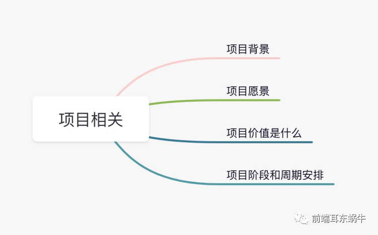

这一部分可能看起来没那么重要，但是做项目对于项目的关键信息还是要了解的。
因为当我们在和其他不了解我们目前在做的项目的同学沟通的时候，他们可能会问下面的一些东西。

### 2.1 项目背景

通过项目背景了解当前业务痛点，想通过我们的产品达到什么样的效果。举例：

- 营销增长（如：针对店铺运营可视化程度不够，会员缺失有效管理等）
- 共享与组织能力（如：出账较慢，对账效率低等）
- 技术与架构（如：现存各系统协同不足，性能和功能影响业务等）

### 2.2 项目愿景

以公司项目为例，这里说的比较简单。

基于中台架构完整构建业务应用，实现业务全流程贯通，实现业务实施在线和数据口径统一，并通过中台能力，实现自动化营销，统一账户管理。

### 2.3 项目价值是什么

- 增加收入
- 提升效率
- 降低成本
- 加强内控

### 2.4 项目阶段和周期安排

这个还是比较重要的，因为负责的开发任务是具有阶段性的，分为几个阶段，几个迭代，每个时间段需要做什么，有什么样的产出，是不是在业务流程上面达成共识。
这个很重要。这个在下面进行任务排期的时候也会考虑进来。

## 3. 团队相关

这里主要是对于团队内部的`人员熟悉`和`周会早会`的汇报形式和内容形式的了解。
有利于后期的协作。

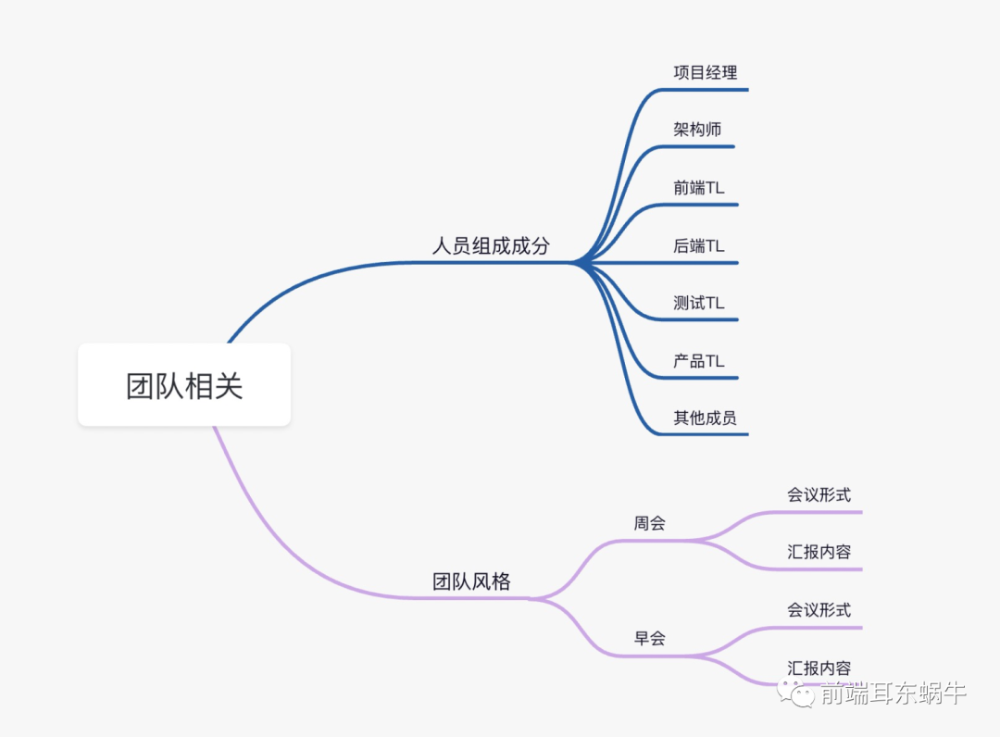

## 4. 前端相关

### 4.1 架构相关

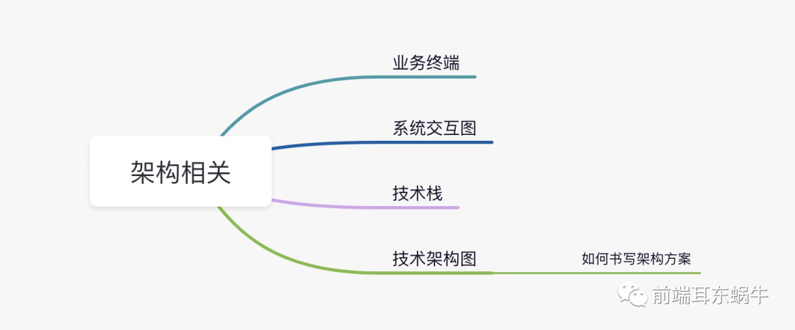

这一部分主要是为了能够给予业务，满足业务的情况下设计书写出技术架构图。
前面三个是为了能够做好技术架构的基础信息了解。

**如何书写架构方案？**

这个其实我个人也没有很好的方法论。贴两张以前画过的图：

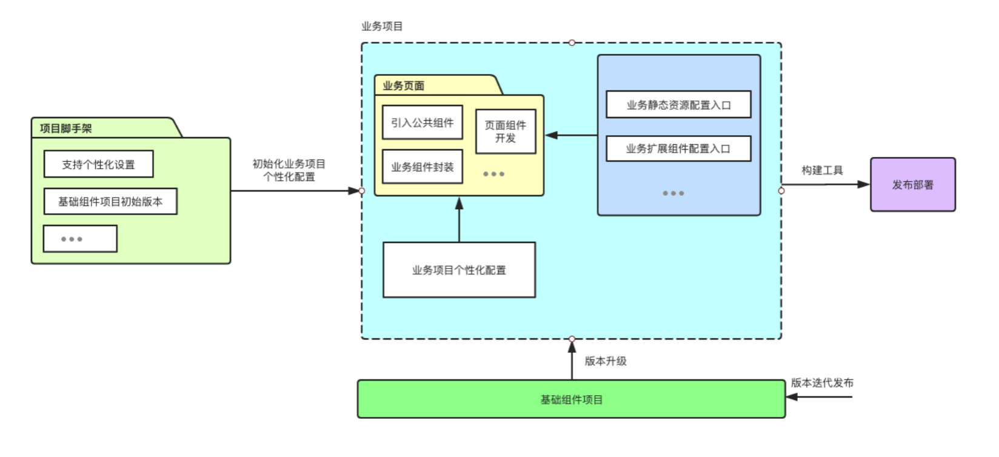
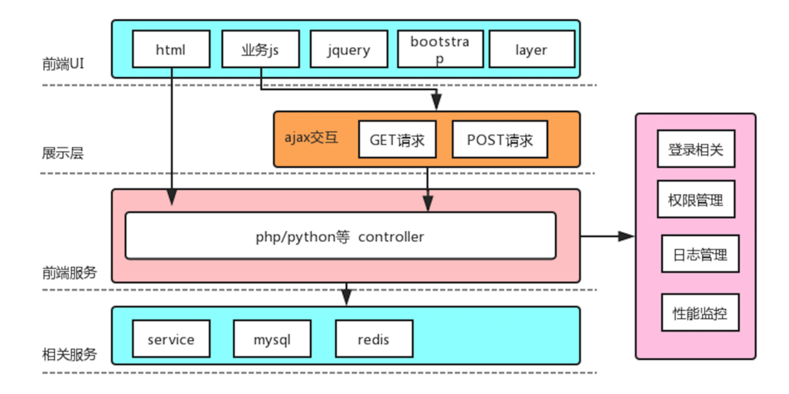

但是到底技术架构图的标准是什么？以下是个人的一些心得和理解。

- 技术架构：上面图主要表现的就是技术架构；
- 业务边界：针对不同的业务场景，边界清晰，明确有哪些业务是不支持的；
- 业务架构：针对具体的业务场景进行技术支持。例如我们遇到多页面部署的需求，就需要特别支持。
- 集成架构：其他系统的集成；
- 部署架构：部署上线的流程；
- 等；

### 4.2 技术相关

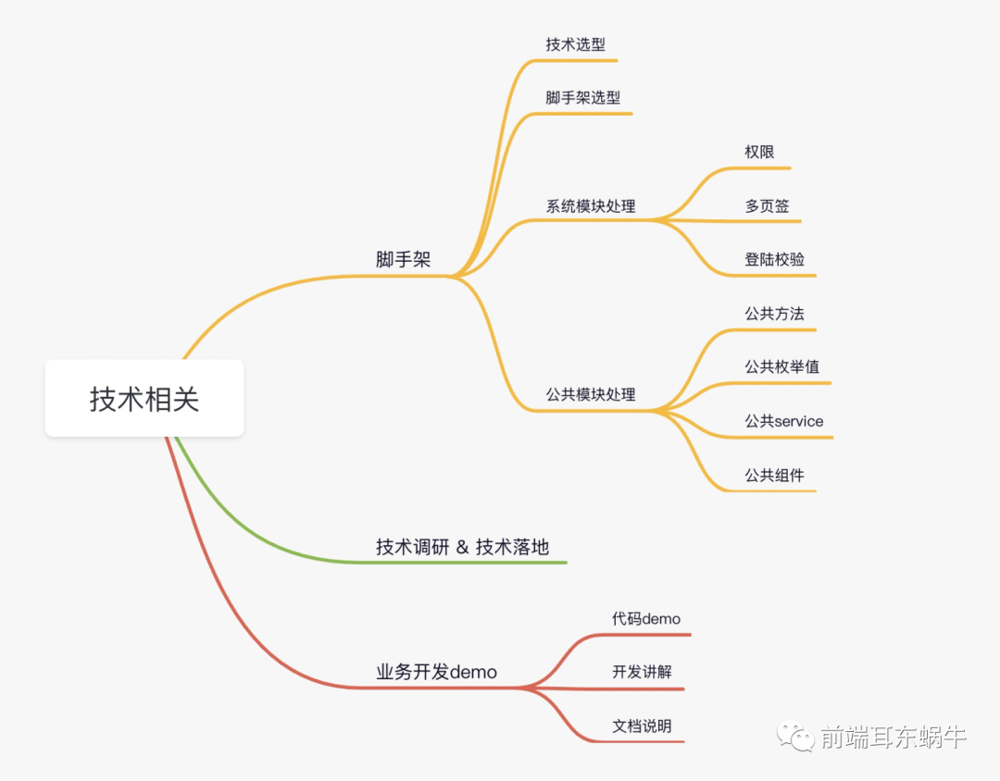

#### 4.2.1 脚手架

**确认初始化流程**

比如是在线执行初始化项目，还是本地执行初始化项目。
以及脚手架更新后，怎么触达项目驱动更新等。

**确定脚手架包含内容**

- 权限管理；
- 登录校验；
- 公共方法：公共方法的放置；
- 公共枚举值；
- 公共 `service`: 数据接口处理；
- 公共组件：位置放置和规范；

#### 4.2.2 技术调研 & 技术落地

疑难问题的技术调研和技术落地方案。

根据实际团队的技术栈情况，和当前项目的现有情况，确定技术方案，支持项目中遇到的疑难问题。

#### 4.2.3 业务开发 Demo

这是为了最大化的解决项目中初级开发者常遇到的开发问题。

- 代码 `demo`: 业务开发的 `demo` 代码；
- 开发讲解：同步讲解 `demo` 的开发模式；
- 文档说明：沉淀文档说明；

### 4.3 任务划分相关

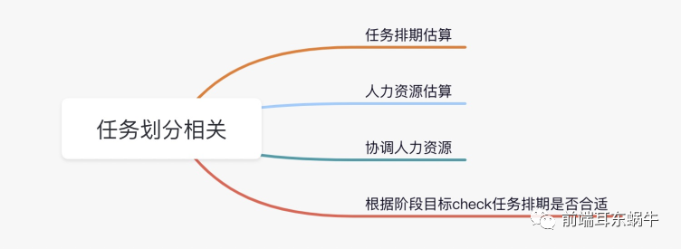

**根据阶段目标 check 任务排期是否合适**

这里着重提出来，是和项目相关部分提到的阶段目标有关系。
需要和阶段目标契合，这样在一个时间段，我们项目整体协作出来的东西才是完整的东西。

### 4.4 规范相关

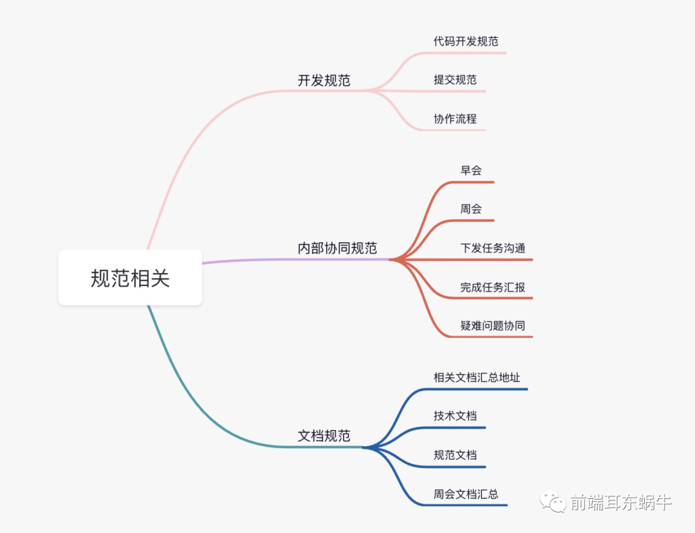

### 4.5 前端部门相关

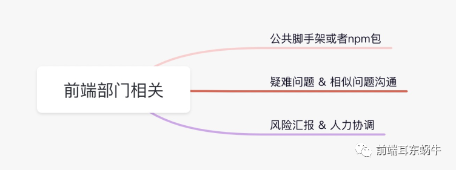

## 5. 协作相关

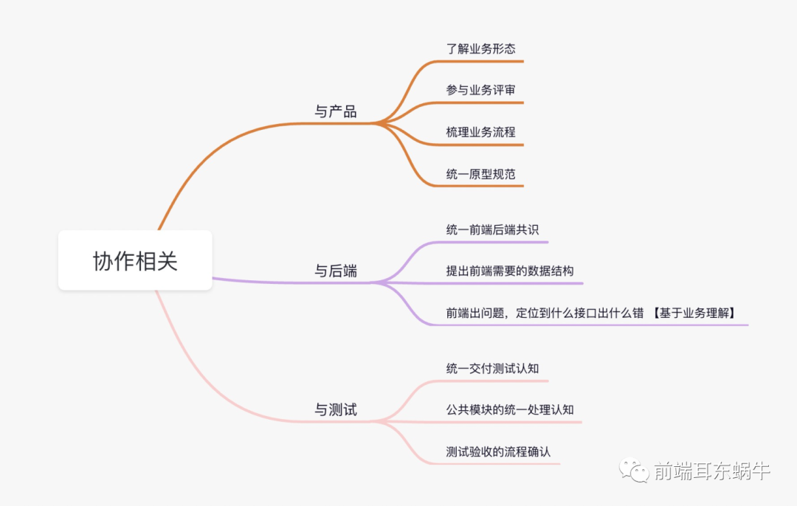

### 5.1 与产品

**统一原型规范**

这里着重说明：统一原型规范，就是原型的输出要保证，同样的交互页面风格要保持统一，不允许有很大差距。
这样可以规避：

- 原型输出不像一个系统；
- 代码开发内耗；

### 5.2 与后端

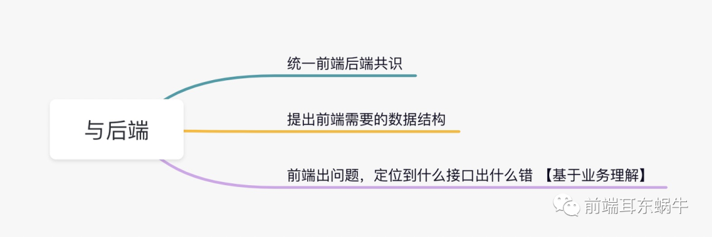

**统一前端后共识**

这里着重说明：前后端对于一些事情处理需要达成共识，这样会节省很多沟通问题。

- 数据字典统一查询；
- 接口字段格式保持统一；
- 日期格式；
- 复杂数据结构处理；
- 页面逻辑判断相关，前端处理还是后端处理；

### 5.3 与测试

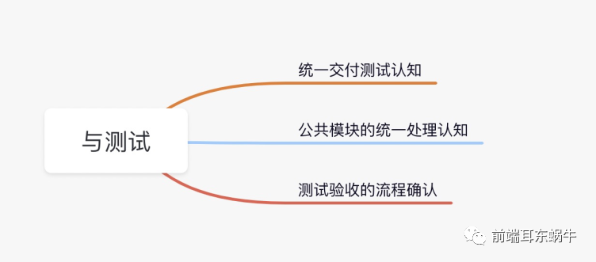

**统一交付测试认知**

- 界面无明显的 `UI` 类型 `BUG`，与原型图、`UI` 设计图保持一致，关于页面的设计、排版都能够符合产品需求。如有修改应和产品、`UI` 沟通一致并且进行修改。
- 功能能够实现产品的需求，且输入文本框、选择框、翻页按钮、新增校验等能够与产品原型一致。还需要考虑字段长度过长的情况如何处理。
- 当前所做的功能应该是流程性功能，不止需要考虑当前页面的功能实现，需要考虑一下前置的数据是从哪里来，在当前的数据展示是否合理。
  前置的业务数据是否能够在当前页面跑下去或者完成。
- 每次做完当前页面或者修改当前页面的功能时，调接口跑通流程，看当前页面是否可以传输数据给后端，并且成功返回响应。

**公共模块的统一处理认知**

- 页面提示语的确定

  - 表单页面提交不需要 `confirm` 提示语；
  - 数据删除/列表页更新状态需要 `confirm` 提示语；
  - 新建页面路由跳转离开不需要提示语；

- `form` 表单的处理
  - `form` 表单必填项验证；
    `form` 表单必填项/非必填项的长度验证（依赖于数据库设定或者也存在统一长度限制）；
  - `form` 表单数字验证/电话验证/邮件验证；
  - `form` 表单日期范围验证的设定；
    `startDate` 的日期范围验证是否是只可以点击当天之前/当天之后，`endDate` 的选择开始日期一般为 `startDate` 的日期之后；
  - `form` 表单的特殊字符验证；

## 参考

- [前端项目负责人在项目初期需要做什么？](https://mp.weixin.qq.com/s/7PJlpHWWdbT-10bDzQd2WA)
