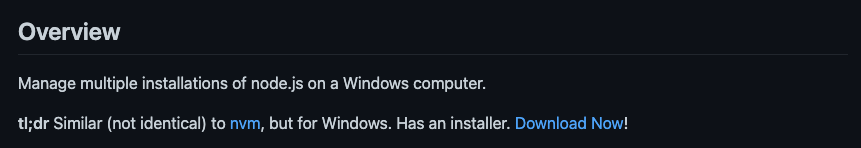
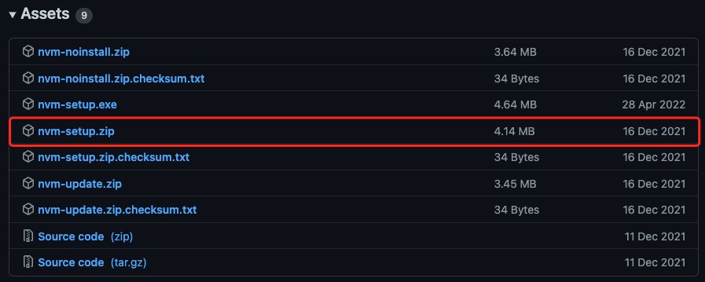
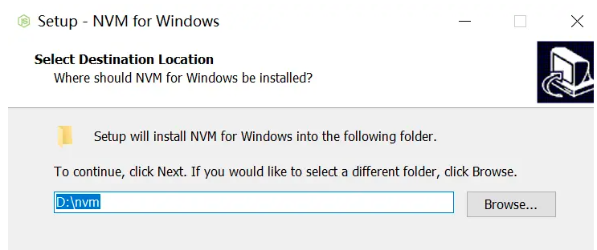
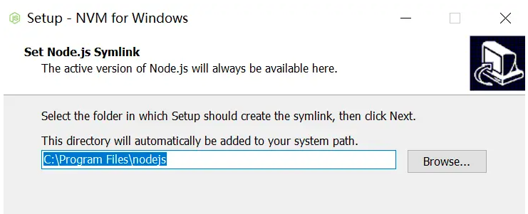

## Windows 在线安装 Nvm & Node

### 1. Nvm 介绍

一般我们用的项目都是在指定的 `node` 版本创建的，如果后面出现新的 `node` 版本，这时更新的话就有可能会造成项目不能使用等问题。
所以我们既要让项目能正常运行，又想要用用新版 `node` 的新功能。

这时可以使用 `nvm` 来进行 `node` 版本切换, `nvm` 可以下载多个 `node` 版本并且可以切换到指定的版本。

如果之前有安装过 `Node.js`, 第一步需要首先去控制面板卸载 `node`, 卸载后查看是否还有 `node` 安装路径，如果有的话将其删除。

### 2. Nvm 下载

#### 2.1 下载安装包

1. [GitHub 地址](https://github.com/coreybutler/nvm-windows)

2. 进入下载页面



其实也可以[直接到下载页](https://github.com/coreybutler/nvm-windows/releases)

3. 点击下载安装包



### 3. 安装 Nvm

安装包 `nvm-setup.exe` 双击安装即可。

可设置 nvm 的安装路径：



可设置 node 的安装路径：



### 4. 检查 Nvm 是否安装成功

`CMD` 命令行执行：

```bash
nvm version
# 1.1.9
```

有版本号展示，说明安装成功了。

### 5. Node 安装

#### 5.1 安装 Node 版本

`CMD` 命令行执行：

```bash
nvm install 16.0.0
```

#### 5.2 Nvm 指定 Node 版本

`CMD` 命令行执行：

```bash
nvm use 16.0.0

node -v
# v16.0.0
```

常见问题：

1. 切换的时候报错：

```bash
# exit status 1: 乱码
```

或者：

```bash
# exit status 1: You do not have sufficient privilege to perform this operation.
```

可以尝试通过管理员打开 `cmd`, 再输入命令执行。
即：`开始 > 键入 cmd > 右键单击并以管理员身份运行`。

```bash
nvm use 16.0.0
# Now using node v16.0.0 (64-bit)
```

2. 如果 `npm` 没有执行成功：

```bash
node -v
# v16.0.0

npm -V
# 'npm' 不是内部或外部命令，也不是可运行的程序或批处理文件。
```

那么，需要通过 `nvm list available`查看可用版本，重新安装：

```bash
nvm list available
# |   CURRENT    |     LTS      |  OLD STABLE  | OLD UNSTABLE |
# |--------------|--------------|--------------|--------------|
# |    18.7.0    |   16.16.0    |   0.12.18    |   0.11.16    |
# |    18.6.0    |   16.15.1    |   0.12.17    |   0.11.15    |
# |    18.5.0    |   16.15.0    |   0.12.16    |   0.11.14    |
# |    18.4.0    |   16.14.2    |   0.12.15    |   0.11.13    |
# |    18.3.0    |   16.14.1    |   0.12.14    |   0.11.12    |
# |    18.2.0    |   16.14.0    |   0.12.13    |   0.11.11    |
# |    18.1.0    |   16.13.2    |   0.12.12    |   0.11.10    |
# |    18.0.0    |   16.13.1    |   0.12.11    |    0.11.9    |
# |    17.9.1    |   16.13.0    |   0.12.10    |    0.11.8    |

# This is a partial list. For a complete list, visit https://nodejs.org/en/download/releases
```

发现 `v16.0.0` 不在里面，这个时候就找一个存在的版本，重新安装：

```bash
nvm install 16.13.0
# Downloading node.js version 16.13.0 (64-bit)...
# Extracting...
# Complete

# Installation complete. If you want to use this version, type

nvm use 16.13.0
```

通过 `nvm use 16.13.0` 切换到 `v16.13.0` 后：

```bash
npm -v
# 8.1.0
```

#### 5.3 检查 Node 指定版本是否安装成功

```bash
nvm list

# * 16.0.0 (Currently using 64-bit executable)

node -v
# v16.0.0
```

### 6. 常用的一些 nvm 命令

```bash
nvm list # 可以查看所有已经安装的 node 版本

nvm install # 如 nvm install 16.14.0，安装指定版本

nvm use # 切换到指定的版本

nvm uninstall # 卸载指定版本

nvm on # 启用 node.js 版本管理。

nvm off # 禁用 node.js 版本管理（不卸载任何东西）

nvm root # 设置 nvm 应该存放不同版本的 node.js 的目录。如果未设置，将显示当前根目录。
```

测试执行：

```bash
nvm root

# Current Root: [~User]\AppData\Roaming\nvm
```
