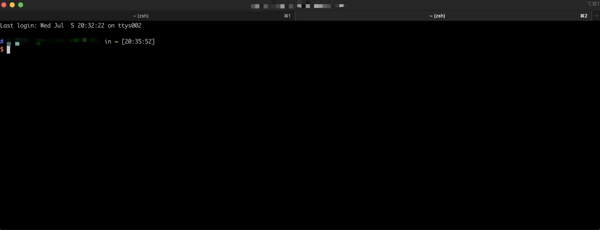
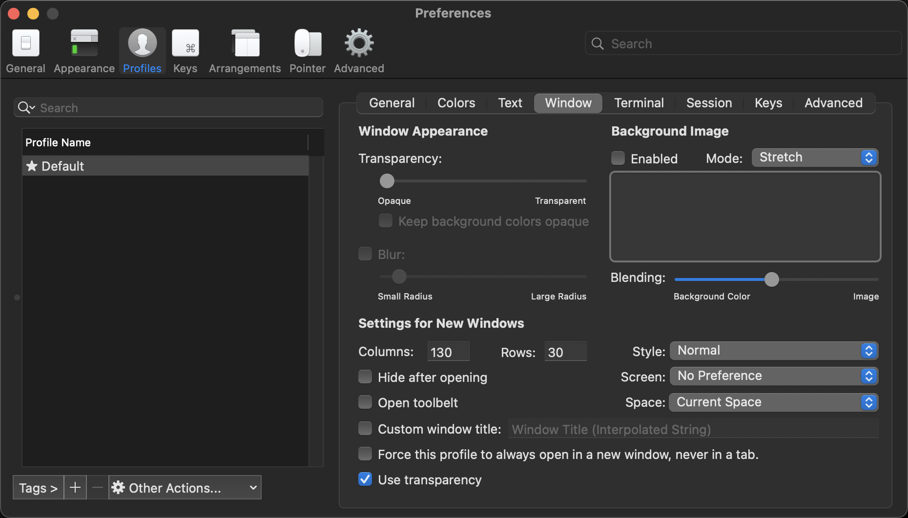

# Mac 使用

## 1. 常见问题

### 1.1 关闭桌面上点不动的确认窗口

组合快捷键：`Command + Option + Shift + Esc`

### 2.2 启动台有异常图标

```bash
defaults write com.apple.dock ResetLaunchPad -bool true

killall Dock
```

这个时候，启动台会重新启动，也会重新排序，需要自己再重新调整。

### 2.3 查看用户主目录

```bash
echo $HOME
# [~User]
```

### 2.4 查看环境变量

```bash
echo $PATH
# [~User]/.yarn/bin:[~User]/.config/yarn/global/node_modules/.bin:[~User]/.nvm/versions/node/v16.14.0/bin:/usr/local/bin:/System/Cryptexes/App/usr/bin:/usr/bin:/bin:/usr/sbin:/sbin:/Library/Apple/usr/bin
```

### 2.5 iTerm 快捷键

`iTerm` 当前窗口分屏:

- `Command + D`


`iTerm` 新建 tab 窗口:

- `Commnd + T`



### 2.6 iTerm 设置默认窗口大小

1. 打开工具 `iTerm`
2. 点击 `mac` 左上角的 `iTerm2 --> Preferences`
3. 选择 `Profiles`
4. `Windows` 设置



## 2. Mac 设置 ssh 连接检测，保持连接

> 或者说, `Mac` 设置 `ssh` 连接检测，保持连接

mac 使用终端 `ssh` 连接远程服务器，如果长时间没有操作连接会断掉，通过配置心跳让系统保持 `ssh` 连接不断开。

编辑 `/etc/ssh/ssh_config` 添加以下设置可解决这个问题：

```ini
# 断开重连次数
ServerAliveCountMax 5

# 每隔5秒自动发送一个空请求以保持连接
ServerAliveInterval 5
```

## 3. Mac 环境下 iTerm 使用 Git 命令中文显示乱码

1、设置 `iTerm` 的终端编码方式为 `utf-8`

`iTerm` -> `Settings` -> `Perferences` -> `Profiles` -> `Terminal` -> `Character encoding` 为: `UTF-8`。

2、修改 `Git` 配置

```bash
git config --global core.quotepath false
```

可以查看所有配置:

```bash
git config --global --list
```

如果还不行（实际没有遇到，到这里就支持中文了），若还不支持，则继续。

3、设置 `.zshrc`

打开配置文件 `~/.zshrc` ，在文件最后面添加如下代码：

```bash
export LC_ALL=en_US.UTF-8
export LANG=en_US.UTF-8
```

然后执行 `source ~/.zshrc`，使配置生效。
