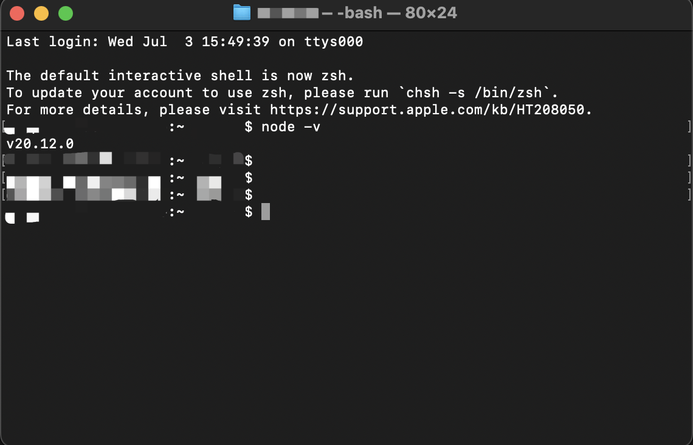
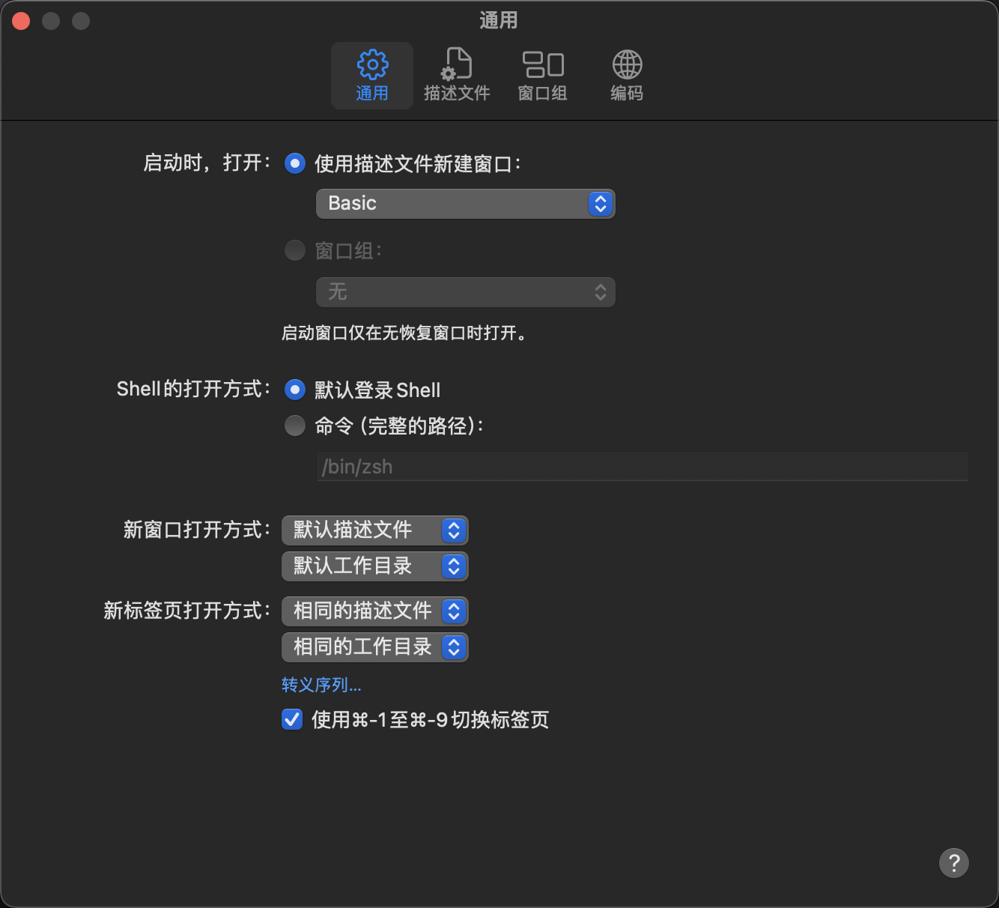
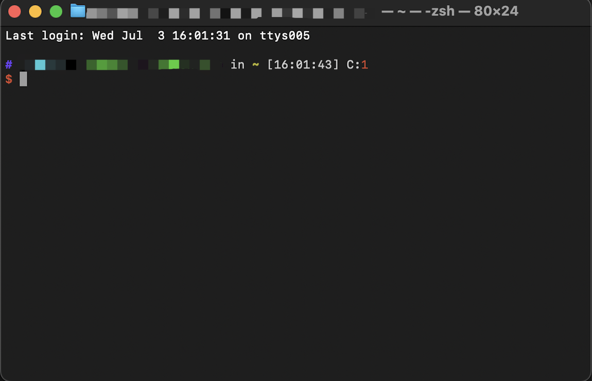

# Mac 中 .bash_profile 和 .zshrc 区别

## 1. `.bash_profile` 和 `.zshrc` 对比

1. `.bash_profile` 和 `.zshrc` 均在 `～` 目录下
2. `.bash_profile`，通过 `source ~/.bash_profile`，只在当前窗口生效
3. `.zshrc`，通过 `source ~/.zshrc`，永久生效，因为 `zsh` 终端 计算机每次启动自动执行 `source ~/.zshrc`
4. `.bashrc`，通过 `source ~/.bashrc`，永久生效，因为 `bash` 终端 计算机每次启动自动执行 `source ~/.bashrc`

## 2. `.bash_profile` 不生效解决办法

一般会在 `~/.zshrc` 中添加 `source ~/.bash_profile`，以确保 `.bash_profile` 中的修改永久生效。

## 3. 扩展

`~` 是 `home` 目录，在 `OS X` 下位于 `/Users/你的用户名/`
`.` 是 `类 unix` 下的隐藏文件，文件名带 `.` 之后在 `GUI 文件管理器` 和 `ls` 的默认设置下不会显示出来，使用 `ls -a` 命令可以显示出这些文件。

## 4. `zsh` 介绍

`zsh` 是 `shell` 语言类型，兼容 `bash`，提供强大的命令行功能，比如 `tab 补全`，`自动纠错功能`等。
`zsh` 的配置文件是 `~/.zshrc`。
缺点就是配置太麻烦，好在有一个叫做 `oh-my-zsh` 的开源项目，很好的弥补了这一缺陷，只需要修修改改配置文件，就能很顺手。
需要安装 `oh-my-zsh` 自动创建 `.zshrc`，直接手动创建 `.zshrc` 没有用。

## 5. 如何保证 `zsh` 和 `bash` 共用配置

```bash
# ~/.zshrc

# Path to your oh-my-zsh installation.
export ZSH=$HOME/.oh-my-zsh

# ... more ...

# 配置shell环境用户环境变量生效
source ~/.bash_profile
```

```bash
# ~/.bash_profile

# ------------ go start ------------
export GO111MODULE=on
export GOPROXY=https://goproxy.cn,direct
# ------------ go end --------------

export NVM_DIR="$HOME/.nvm"
[ -s "/usr/local/opt/nvm/nvm.sh" ] && . "/usr/local/opt/nvm/nvm.sh"  # This loads nvm
[ -s "/usr/local/opt/nvm/etc/bash_completion.d/nvm" ] && . "/usr/local/opt/nvm/etc/bash_completion.d/nvm"  # This loads nvm bash_completion

export PATH="$HOME/.yarn/bin:$HOME/.config/yarn/global/node_modules/.bin:$PATH"

# ... more ...
```

```bash
# ~/.bashrc

# 配置shell环境用户环境变量生效
source ~/.bash_profile

# ... more ...
```

## 6. 修改默认 shell

- [在 Mac 上的“终端”中更改默认 shell](https://support.apple.com/zh-cn/guide/terminal/trml113/mac)


再次打开 终端：



再次修改为 zsh，效果如下：





基于 `zsh` 和 `bash` 的共用配置，这样就可以实现 切换终端为 `bash` 不会出现类似：

```bash
# /bin/sh: node: command not found
```

这样的报错。
