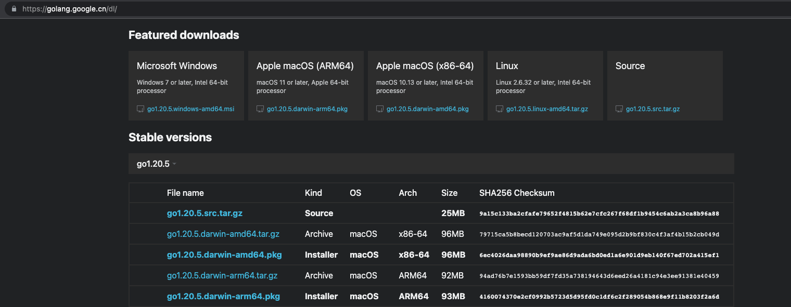

# Mac 下安装 Go 开发环境

## 1. 下载 Go 安装包

官网下载 go 安装包：[https://golang.google.cn/dl/](https://golang.google.cn/dl/)

下载 go 二进制包 `go1.20.5.darwin-amd64.tar.gz` 或 `go1.20.5.darwin-arm64.tar.gz`。

> 注意：选择 `amd64` 还是 `arm64` 取决于你电脑 `CPU` 的架构是 `x86_64` 还是 `arm` 架构。
> `x86` 用 `amd64` 的包，`arm` 则用 `arm64` 的包。
> `mac` 的 `CPU` 目前主要有 `2` 种，分别 `Intel` 和 `M` 系列如 m1, m2。
> `CPU` 为 `Intel` 的则为 `x86_64` 架构，`CPU` 为 `M` 系列的 m1, m2, … 则为 `arm` 架构。

### 1.1 直接下载



```bash
ls
# go1.20.5.darwin-amd64.pkg
```

### 1.2 命令行下载

```bash
cd [SoftwaresGo]
wget -c https://golang.google.cn/dl/go1.20.5.darwin-amd64.tar.gz
# --2023-06-21 12:04:54--  https://golang.google.cn/dl/go1.20.5.darwin-amd64.tar.gz
# 正在解析主机 golang.google.cn (golang.google.cn)... 220.181.174.34
# 正在连接 golang.google.cn (golang.google.cn)|220.181.174.34|:443... 已连接。
# 已发出 HTTP 请求，正在等待回应... 302 Found
# 位置：https://dl.google.com/go/go1.20.5.darwin-amd64.tar.gz [跟随至新的 URL]
# --2023-06-21 12:04:54--  https://dl.google.com/go/go1.20.5.darwin-amd64.tar.gz
# 正在解析主机 dl.google.com (dl.google.com)... 220.181.174.33
# 正在连接 dl.google.com (dl.google.com)|220.181.174.33|:443... 已连接。
# 已发出 HTTP 请求，正在等待回应... 200 OK
# 长度：100202970 (96M) [application/x-gzip]
# 正在保存至: “go1.20.5.darwin-amd64.tar.gz”

# go1.20.5.darwin-amd64.tar. 100%[=======================================>]  95.56M  1.72MB/s  用时 57s

# 2023-06-21 12:05:52 (1.67 MB/s) - 已保存 “go1.20.5.darwin-amd64.tar.gz” [100202970/100202970])
```

```bash
ls
# go1.20.5.darwin-amd64.tar.gz
```

## 2. 安装 Go

### 2.1 pkg 直接安装


默认会安装到 `/usr/local/go` 文件夹下。

### 2.2 命令行解压安装

安装目录：`/usr/local/go`。

因为 `go1.20.5.darwin-amd64.tar.gz` 解压后的文件夹为 `go`，所以：

```bash
sudo tar -xzvf go1.20.5.darwin-amd64.tar.gz -C /usr/local
```

```bash
cd /usr/local/go
ls
# CONTRIBUTING.md README.md       api             doc             pkg
# LICENSE         SECURITY.md     bin             lib             src
# PATENTS         VERSION         codereview.cfg  misc            test
```

## 3. 配置环境变量

### 3.1 设置环境变量

没有 `~/.bash_profile` 文件，需要先新增：

```bash
touch ~/.bash_profile
```

编辑 `~/.bash_profile` 文件：

```bash
vim ~/.bash_profile
```

追加以下内容：

```bash
export GOROOT=/usr/local/go
export PATH=$PATH:$GOROOT/bin
```

> 注意：`go 1.13` 版本以后可以不配置 `GOPATH` 了。`GOPATH` 默认为 `$HOME/go`，即 `~/go`
> 因为 `go 1.11` 版本之后，使用 `go mod` 管理项目。

### 3.2 配置默认生效

编辑 `~/.zshrc` 文件：

```bash
$ vim ~/.zshrc
```

追加以下内容：

```bash
source ~/.bash_profile
```

使当前终端窗口对以上配置的环境变量生效：

```bash
source ~/.zshrc
```

## 4. 检测开发环境

### 4.1 查看配置

```bash
$ go env
GO111MODULE=""
GOARCH="amd64"
GOBIN=""
GOCACHE="/Users/[username]/Library/Caches/go-build"
GOENV="/Users/[username]/Library/Application Support/go/env"
GOEXE=""
GOEXPERIMENT=""
GOFLAGS=""
GOHOSTARCH="amd64"
GOHOSTOS="darwin"
GOINSECURE=""
GOMODCACHE="/Users/[username]/go/pkg/mod"
GONOPROXY=""
GONOSUMDB=""
GOOS="darwin"
GOPATH="/Users/[username]/go"
GOPRIVATE=""
GOPROXY="https://proxy.golang.org,direct"
GOROOT="/usr/local/go"
GOSUMDB="sum.golang.org"
GOTMPDIR=""
GOTOOLDIR="/usr/local/go/pkg/tool/darwin_amd64"
GOVCS=""
GOVERSION="go1.20.5"
GCCGO="gccgo"
GOAMD64="v1"
AR="ar"
CC="clang"
CXX="clang++"
CGO_ENABLED="1"
GOMOD="/dev/null"
GOWORK=""
CGO_CFLAGS="-O2 -g"
CGO_CPPFLAGS=""
CGO_CXXFLAGS="-O2 -g"
CGO_FFLAGS="-O2 -g"
CGO_LDFLAGS="-O2 -g"
PKG_CONFIG="pkg-config"
GOGCCFLAGS="-fPIC -arch x86_64 -m64 -pthread -fno-caret-diagnostics -Qunused-arguments -fmessage-length=0 -fdebug-prefix-map=/var/folders/dq/pd5gw3qn5hs2n8p7kmd1r4qr0000gn/T/go-build3861989891=/tmp/go-build -gno-record-gcc-switches -fno-common"

```

其中，

- `GOPATH`： go 工作区，下载的包会统一放在里面；
- `GOROOT`： go 的安装目录；

### 4.2 查看版本

```bash
go version
# go version go1.20.5 darwin/amd64
```

### 4.3 开启 go modules 功能

> 默认启用，其实不需要手动设置开启。

- `GO111MODULE=off`，无模块支持，go 命令行将不会支持 module 功能，寻找依赖包的方式将会沿用旧版本那种通过 vendor 目录或者 GOPATH 模式来查找。
- `GO111MODULE=on`，模块支持，go 命令行会使用 modules，而一点也不会去 GOPATH 目录下查找。
- `GO111MODULE=auto`，默认值，go 命令行将会根据当前目录来决定是否启用 module 功能。这种情况下可以分为两种情形：

  - 当前目录在 `GOPATH/src` 之外且该目录包含 `go.mod` 文件，开启模块支持。
  - 当前文件在包含 `go.mod` 文件的目录下面，开启模块支持。

> 注：
> 在使用 `go modules` 时，`GOPATH` 是无意义的，不过它还是会把下载的依赖存储在 `$GOPATH/pkg/mod` 中
> 也会把 `go install` 的结果放在 `$GOPATH/bin` 中。
>
> 当 `modules` 功能启用时，依赖包的存放位置变更为 `$GOPATH/pkg`
> 允许同一个 package 多个版本并存，且多个项目可以共享缓存的 module。

编辑 `~/.bash_profile`：

```bash
vim ~/.bash_profile
```

追加以下内容：

```bash
export GO111MODULE=on
```

或者以下一行命令即可：

```bash
go env -w GO111MODULE=on
```

使以上配置的环境变量生效：

```bash
source ~/.zshrc
```

验证：

```bash
go env
# GO111MODULE="on"
# ... 省略
```

## 5. 设置 Go 国内模块代理

编辑 `~/.bash_profile`：

```bash
vim ~/.bash_profile
```

追加以下内容：

```bash
export GOPROXY=https://goproxy.cn
```

使以上配置的环境变量生效：

```bash
source ~/.zshrc
```

验证：

```bash
go env
# ... 省略
# GOPROXY="https://goproxy.cn"
# ... 省略
```

## 6. hello 项目

新增项目目录：

```bash
cd $GOPATH/src
mkdir -p hello

# 初始化 mod
go mod init hello
# go: creating new go.mod: module hello
# go: to add module requirements and sums:
go mod tidy
```

新增项目文件：

```go
// hello.go

package main

import "fmt"

func main() {
  fmt.Println("Hello, World!")
}
```

```bash
cd $GOPATH/src/hello
# 扫描所有我们 import 到的包，并生成对应的记录到 gomod 文件里
go mod tidy
```

其中：

`go mod tidy`，增加缺少的 `module`， 删除无用的 `module`。

看下文件有什么不同，发现多了一个 `go.mod` 文件：

```bash
ls
# go.mod   hello.go
cat go.mod
# module hello

# go 1.20
```

然后开始运行测试了。

直接运行：

```bash
cd $GOPATH/src/hello
go run hello.go
# Hello, World!
```

编译生成二进制文件：

```bash
cd $GOPATH/src/hello
go build hello.go
ls
# hello    hello.go
```

编译文件运行：

```bash
cd $GOPATH/src/hello
./hello
# Hello, World!
```

## 7. 常用命令

```bash
# 查看 go 当前版本
go version
# 查看当前 go 的环境变量
go env
# 列出当前全部安装的依赖库
go list
#  编辑并运行 go 程序
go run
# 自动更新依赖库，-u 可以自动拉取最新版本，如果不带 -u，则本地如果有包的话，当执行成功处理
go get -u
# 初始化 module
go init mod [模块名]
# 增加缺少的 module，删除无用的 module
go mod tidy
```

## 8. 配置 golang 环境下的 swagger

要使用 `swaggo`，首先要下载一个 `swag` 命令行。

[文档地址](https://pkg.go.dev/github.com/swaggo/gin-swagger)

```
Starting in Go 1.17, installing executables with go get is deprecated. go install may be used instead:

go install github.com/swaggo/swag/cmd/swag@latest
```

执行 `go install github.com/swaggo/swag/cmd/swag@latest` 后，
查看我们的 `bin` 目录下多了一个 `swag` 命令文件。

```bash
cd $GOPATH/bin
ll
# -rwxr-xr-x  1 [username]  staff    14M  7  4 22:51 swag
```

我们还需要编辑 `mac` 的环境变量才能在命令行里面使用 `swag` 命令。

```bash
vim .bash_profile
```

在 `GOPATH` 后面添加一行：

```bash
export GOPATH=$HOME/go
export PATH=$PATH:$GOPATH/bin
```

然后使用命令:

```bash
source ~/.zshrc
```

更新环境变量。
配置环境变量结束之后就可以在命令行里面使用 `swag` 了。
