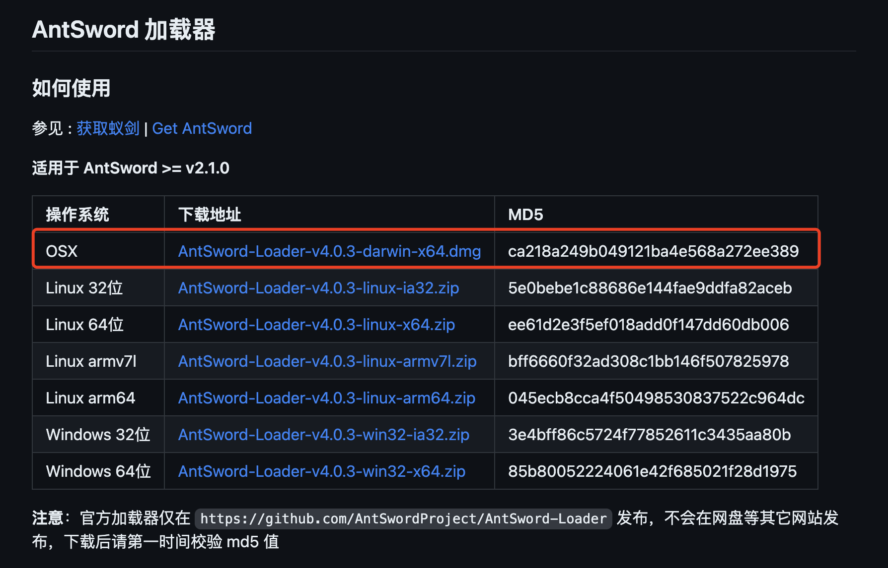
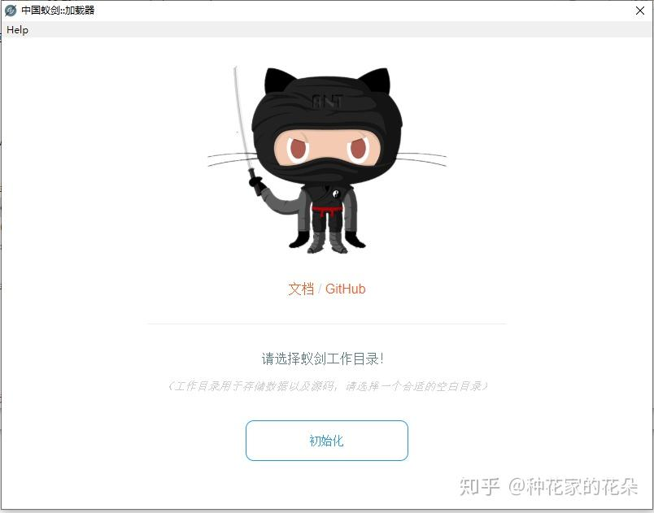
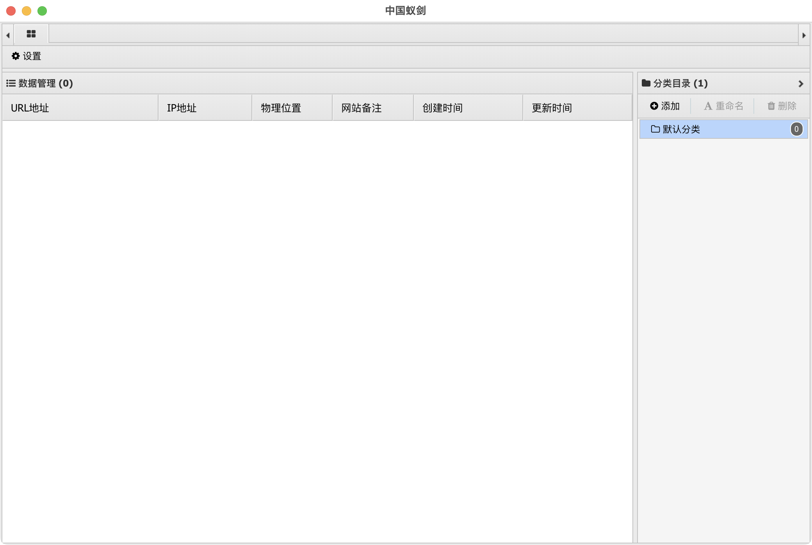
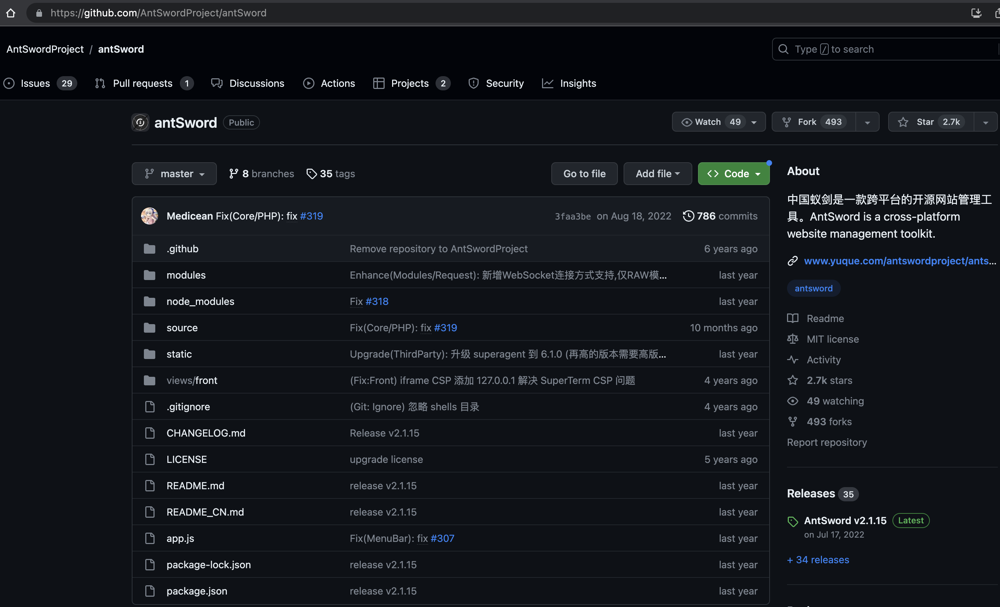
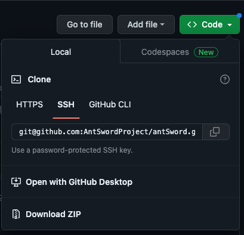

# Mac 安装蚁剑

> 特别注意：安装路径不能有中文。

## 1. 相关链接

[AntSword-Loader](https://github.com/AntSwordProject/AntSword-Loader)
[antSword](https://github.com/AntSwordProject/antSword)

## 2. 安装 AntSword 加载器



安装后：



## 3. 通过 加载器 安装 AntSword

### 3.1 在线加载

点击 `初始化` --> `选择文件夹`。

这个时候就会自动下载 `antSword-master.zip` 文件并且进行解压到 `antSword-master` 安装。



比如选择的文件夹是 `softwares`，则安装后的目录就为 `softwares/antSword-master`。

### 3.2 离线加载

也可以提前下载好源码，放到指定目录：



可以下载 `zip` 包的方式：



然后解压到安装目录，如 `antSword`

也可以通过 `git clone` 的方式下载：

```bash
git clone git@github.com:AntSwordProject/antSword.git
```

打开加载器，选择源代码所在目录（简单理解为 `app.js` 所在目录）。
如 `app.js` 路径为：`softwares/antSword/app.js`，那么选择的目录则是 `softwares/antSword`。
