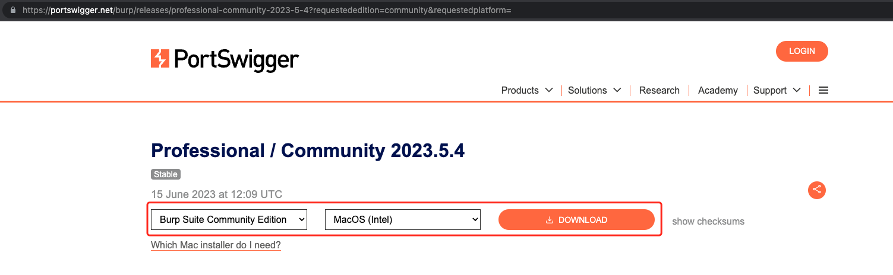
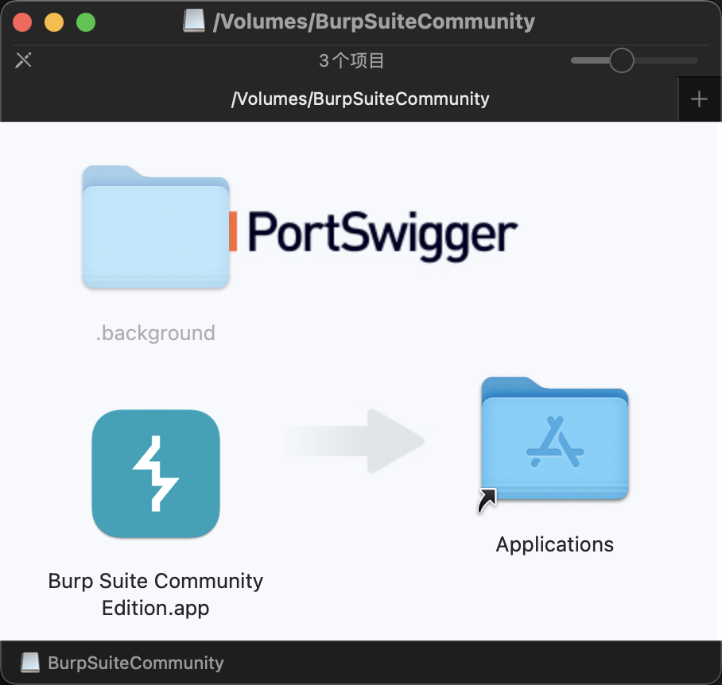
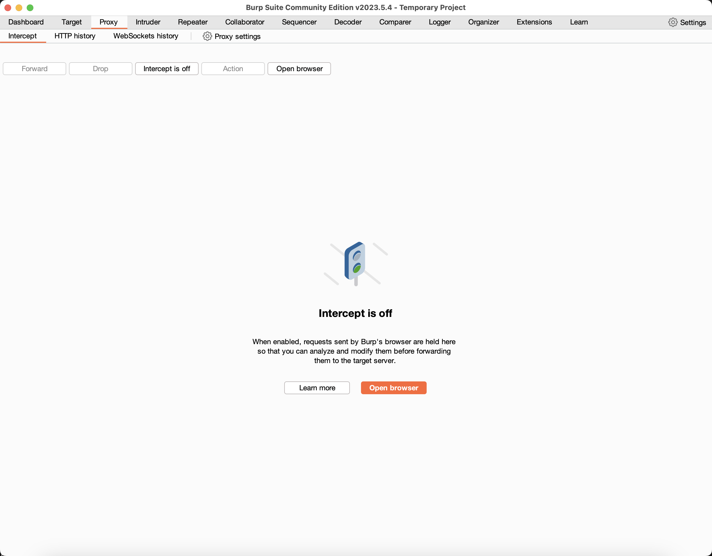

# Mac 安装 BurpSuite

## 1. 官网下载社区版

[官网入口](https://portswigger.net/burp)

选择 `Burp Suite Community Edition`，进入 `https://portswigger.net/burp/communitydownload`。

输入 `自己的邮箱`，点击 `DOWNLOAD`。

## 2. 安装社区版

下载得到 `burpsuite_community_macos_x64_v2023_5_4.dmg`，然后继续安装即可。

安装完成后打开：

但重新打开发现，社区版有些功能受限。
所以条件允许的话，还是卸载掉它，安装 `专业版` 吧。
