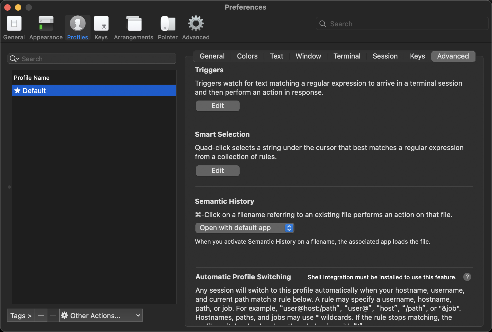
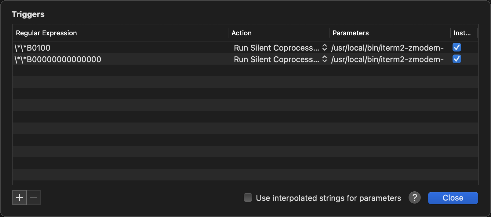

# iTerm2 支持 rz 和 sz

## 1. 安装 lrzsz

```bash
brew install lrzsz
```

查看安装目录：

```bash
brew list lrzsz
# /usr/local/Cellar/lrzsz/0.12.20_1/bin/lrb
# /usr/local/Cellar/lrzsz/0.12.20_1/bin/lrx
# /usr/local/Cellar/lrzsz/0.12.20_1/bin/lrz
# /usr/local/Cellar/lrzsz/0.12.20_1/bin/lsb
# /usr/local/Cellar/lrzsz/0.12.20_1/bin/lsx
# /usr/local/Cellar/lrzsz/0.12.20_1/bin/lsz
# /usr/local/Cellar/lrzsz/0.12.20_1/bin/rz
# /usr/local/Cellar/lrzsz/0.12.20_1/bin/sz
# /usr/local/Cellar/lrzsz/0.12.20_1/share/man/ (2 files)
```

## 2. 下载 iterm2-zmodem

执行:

```bash
git clone https://github.com/aikuyun/iterm2-zmodem.git
cd iterm2-zmodem
```

会发现有以下两个文件：

```bash
ll
# iterm2-recv-zmodem.sh
# iterm2-send-zmodem.sh
```

克隆到本地,并赋值到对应文件中，并赋值权限:

```bash
cp iterm2-* /usr/local/bin
cd /usr/local/bin
```

修改上述两个脚本：

```bash
# iterm2-recv-zmodem.sh

# ...
# 原 /usr/local/bin/rz 改为:
/opt/homebrew/Cellar/lrzsz/0.12.20_1/bin/rz # ...
# ...
```

```bash
# iterm2-send-zmodem.sh

# ...
# 原 /usr/local/bin/sz 改为:
/opt/homebrew/Cellar/lrzsz/0.12.20_1/bin/sz # ...
# ...
```

修改文件权限：

```bash
sudo chmod +x /usr/local/bin/iterm2*
```

## 3. iTerm2 配置

进入 `iterm2` 配置项 `Profiles -> Open Profiles -> Edit Profiles -> Profiles -> Advanced` 中的 `Tirgger`:



`triggers` 中增加两项:

```
Regular expression:  \*\*B0100
Action: Run Silent Coprocess
Parameters: /usr/local/bin/iterm2-send-zmodem.sh

Regular expression:  \*\*B00000000000000
Action: Run Silent Coprocess
Parameters: /usr/local/bin/iterm2-recv-zmodem.sh
```



## 4. 执行 sz rz 命令

```bash
sz -ybe <filepath>
```

然后选择存放文件目录即可。

```bash
rz -ybe
```

然后选取要上传的文件即可。

## 5. 参数解释

```bash
sz --help
  # -b, --binary                binary transfer
  # -e, --escape                escape all control characters (Z)
  # -y, --overwrite             overwrite existing files
```
