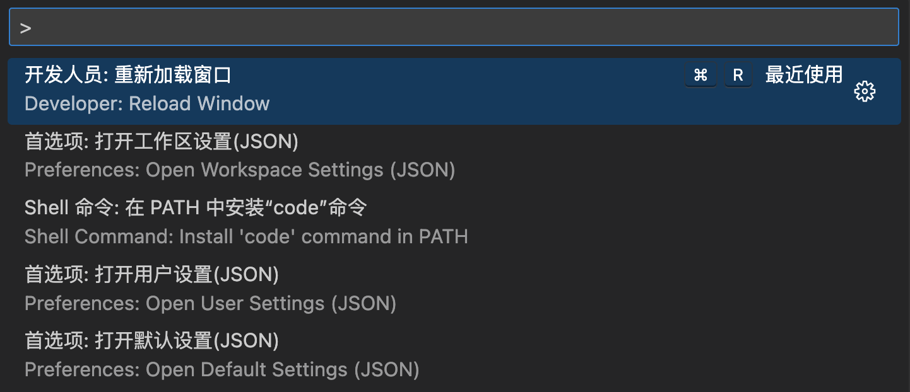
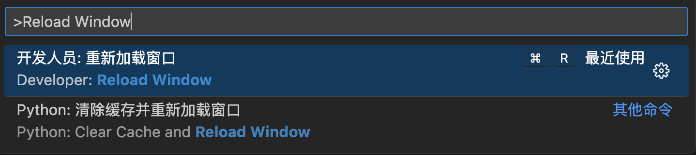
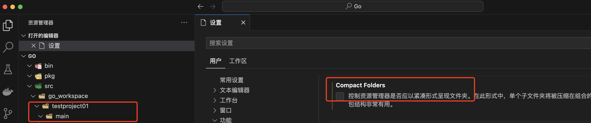

# VS Code 使用

## 1. 常用快捷键

### 1.1 打开控制面板

组合快捷键：`Command + Shift + P`



### 1.2 重新加载窗口

打开`控制面板`后，输入：

```
> Reload Window
```

即可看到选项：



## 2. 文件夹取消折叠

> 设置 -> 用户 -> 功能 -> 资源管理器 -> Compact Folders


