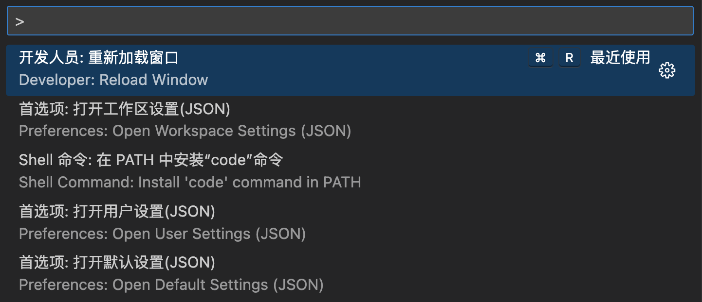
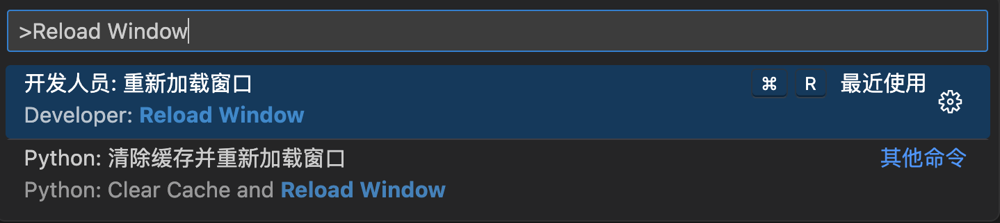
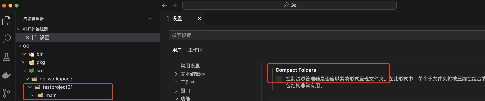

# VS Code 使用

## 1. 常用快捷键

### 1.1 打开控制面板

组合快捷键：`Command + Shift + P`



### 1.2 重新加载窗口

打开`控制面板`后，输入：

```
> Reload Window
```

即可看到选项：



## 2. 文件夹取消折叠

> 设置 -> 用户 -> 功能 -> 资源管理器 -> Compact Folders



## 3. Command line extension management

[Command line extension management](https://code.visualstudio.com/docs/configure/extensions/extension-marketplace)

```bash
code --extensions-dir <dir>
    Set the root path for extensions.
code --list-extensions
    List the installed extensions.
code --show-versions
    Show versions of installed extensions, when using --list-extension.
code --install-extension (<extension-id> | <extension-vsix-path>)
    Installs an extension.
code --uninstall-extension (<extension-id>)
    Uninstalls an extension.
code --enable-proposed-api (<extension-id>)
    Enables proposed API features for extensions. Can receive one or more extension IDs to enable individually.
```

如:

```bash
$ code --install-extension anthropic.claude-code
# Installing extensions...
# Installing extension 'anthropic.claude-code'...
# Extension 'anthropic.claude-code' v2.1.3 was successfully installed.
```
