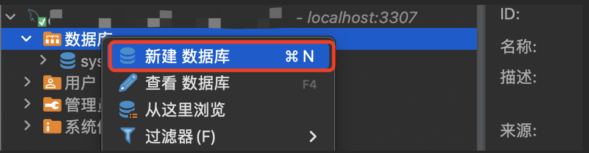
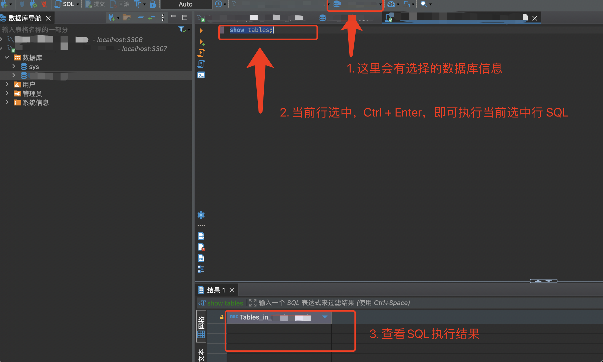

# Mysql 客户端 DBeaver 使用

## 1. 安装

下载地址：https://dbeaver.io/download/

## 2. 连接 Mysql

## 3. mysql8.0 特别配置

## 4. 基本使用

### 4.1 创建数据库

### 4.2 执行 SQL

## 5. 常见问题

### 5.1 DBeaver 连接时报错：Public Key Retrieval is not allowed

- [MySqlConnector | MySQL .NET Connection String Options](https://mysqlconnector.net/connection-options/)

当尝试使用 `DBeaver` 连接 `MySQL` 数据库时遇到 `Public Key Retrieval is not allowed` 错误，意味着不允许自动从服务器检索公钥。解决方法是在 `DBeaver` 的驱动属性中设置 `allowPublicKeyRetrieval` 为 `true`。

`右键`点击`数据库连接`，选择`编辑连接`，在`驱动属性`中修改该设置，保存后即可成功连接。

在 `MySqlConnector` 官网中，`Other Options` 部分内容：

- 如果用户账号使用 `sha256_password` 认证，传输过程中必须保护密码；`TLS` 是首选机制，但如果它不可用，则将使用 `RSA` 公钥加密。要指定服务器的 `RSA` 公钥，请使用 `ServerRSAPublicKeyFile` 连接字符串设置，或设置 `AllowPublicKeyRetrieval=True` 为允许客户端自动从服务器请求公钥。请注意，这 `AllowPublicKeyRetrieval=True` 可能允许恶意代理执行 `MITM` 攻击以获取明文密码，因此 `False` 默认情况下必须显式启用它。
