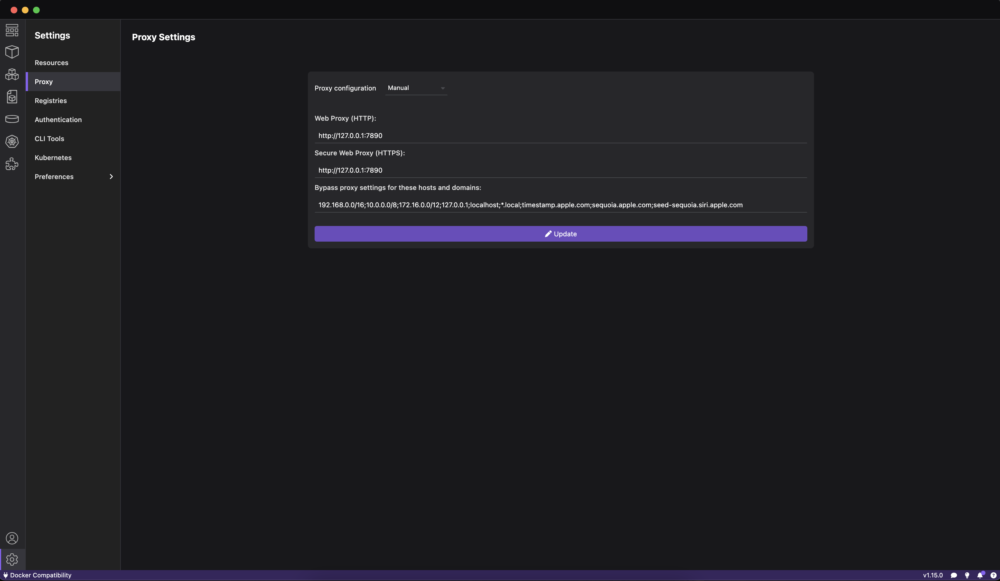
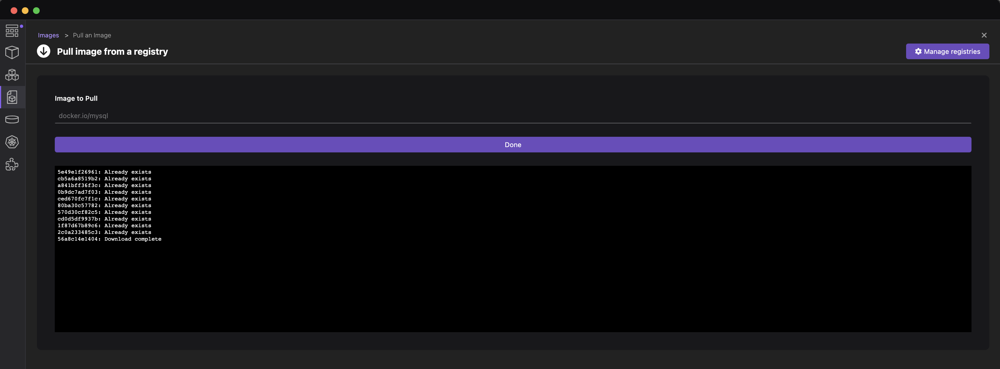
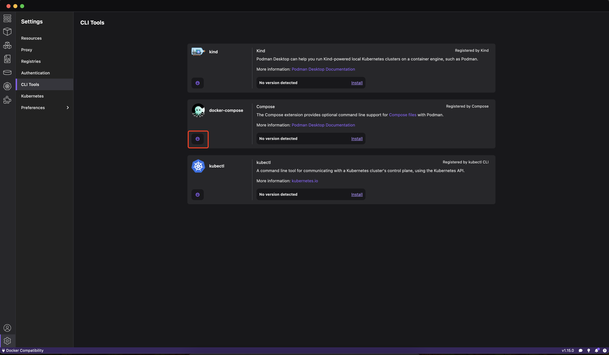

# Podman 安装及配置

## 0. 相关链接

- [Docker Getting Started](https://docs.docker.com/get-started/)
- [Podman 在受限环境中安装](https://desktop.podman.org.cn/docs/proxy)
- [Podman Macos Install](https://desktop.podman.org.cn/docs/installation/macos-install)
- [Github Podman Tags](https://github.com/podman-desktop/podman-desktop/tags)
- [Podman Compose Installation](https://github.com/containers/podman-compose#installation)

## 1. 下载安装

[podman-desktop 下载地址](https://podman-desktop.io/downloads)
如果点不了，或者下载指定版本，可以 [Github](https://github.com/podman-desktop/podman-desktop/tags)下载。

通过命令行安装也可以，但没有试过:

```bash
brew install podman-desktop
```

## 2. 虚拟机配置

### 2.1 初始化虚拟机

`Podman` 在 `Linux` 系统上安装好了就能直接用。但在 `macOS` 上还需要一个额外的虚拟机初始化步骤。
估计在原生的 `Windows` 上使用也是如此。

初始化 `Podman` 虚拟机的命令如下：

```bash
podman machine init
```

第一次执行会下载一个虚拟机的基础系统，系统是 `Fedora CoreOS`。

完成初始化虚拟机的步骤后，就可以正式使用 `podman` 命令了。

### 2.2 虚拟机设置

`Podman` 在这个系统中默认是以 `Rootless` 方式执行的，建议设置为 `Root` 模式，可以避免一些实际应用时的权限问题。切换模式的命令如下:

```bash
podman machine set --rootful
```

如果 `machine` 在 `running` 的情况下，需要先 `stop` 才能设置 `rootful` 模式。

```bash
podman machine stop
# Machine "podman-machine-default" stopped successfully
```

启动 `machine`:

```bash
podman machine start
# Starting machine "podman-machine-default"
# API forwarding listening on: /var/run/docker.sock
# Docker API clients default to this address. You do not need to set DOCKER_HOST.

# Machine "podman-machine-default" started successfully
```

### 2.3 M1 提示 start 失败

如果在 `start` 的时候，弹窗提示:


Mac 对此的解释:

- [If you need to install Rosetta on your Mac](https://support.apple.com/en-hk/102527)
- [如果你需要在 Mac 上安装 Rosetta](https://support.apple.com/zh-cn/102527)

若 `install` 一直没有反应，则需要手动关闭 `Rosetta`:


在 `M1` 芯片低版本 `Podman` 才会出现这个提示，试了下点击 `install Rosetta` 但没有反应，不知道后面版本会不会正常。

这个提示是因为 `docker` 镜像默认构建的是 `amd64` 镜像。而 `M1` 芯片需要 `arm64` 镜像。由于并不是所有镜像都有 `arm64` 版本，所以为了保证 `amd64` 镜像也能在 `M1` 环境上运行，那么就需要 `Rosetta` 这个适配器来做处理。

对于后面构建镜像会同时有 `amd64` 和 `arm64` 的情况越来越多，那么这个 `M1` 上缺少常见镜像(如 nginx, mysql等)的问题会逐渐解决。

## 3. 配置镜像仓库源

如果终端有设置代理，则可以跳过这个步骤。

### 3.1 虚拟机配置：

```bash
podman machine ssh
```

配置文件:

```bash
sudo vi /etc/containers/registries.conf
```

追加配置内容:

```
### 取消从默认地址搜索的仓库域名
unqualified-search-registries = ["docker.io"]

# 自定义搜索器
[[registry]]
# 仓库前缀（镜像前缀）
prefix = "docker.io"
# 加速器地址，此处配置的 docker 中国区源
location = "x1dszur1.mirror.aliyuncs.com"
# 允许通过 http 协议获取镜像
insecure = true
```

这里的加速器地址, 为[阿里云镜像加速器](https://cr.console.aliyun.com/cn-beijing/instances/mirrors)。

`M1` 芯片配置这个，`search` 正常，但 `pull` 不成功：

```bash
# 设置 insecure = false 也不行
podman pull mysql
# Resolving "mysql" using unqualified-search registries (/etc/containers/registries.conf.d/999-podman-machine.conf)
# Trying to pull docker.io/library/mysql:latest...
# Error: initializing source docker://mysql:latest: pinging container registry x1dszur1.mirror.aliyuncs.com: StatusCode: 403, "This request is forbidden. Please proceed to https..."
```

### 3.2 重启虚拟机

```bash
podman machine stop
podman machine start
```

重启后，上面的配置才会生效。

### 3.3 验证是否生效

```bash
podman info
```

打印内容如下:

```yaml
# ...
registries:
    docker.io:
        Blocked: false
        Insecure: true
        Location: x1dszur1.mirror.aliyuncs.com
        MirrorByDigestOnly: false
        Mirrors: null
        Prefix: docker.io
        PullFromMirror: ''
    search:
        - docker.io
# ...
```

## 4. 登录 Registry

```bash
podman login docker.io
# Username: xxx@gmail.com
# Password:
# Login Succeeded!
```

重新执行，如果已登录：

```bash
podman login docker.io
# Authenticating with existing credentials for docker.io
# Existing credentials are valid. Already logged in to docker.io
```

## 5. 查找镜像

```bash
podman search mysql
# NAME                                     DESCRIPTION
# docker.io/library/mysql                  MySQL is a widely used, open-source relation...
```

## 6. 下载镜像

```bash
podman pull mysql:8
# Resolving "mysql" using unqualified-search registries (/etc/containers/registries.conf.d/999-podman-machine.conf)
# Trying to pull docker.io/library/mysql:8...
# Getting image source signatures
# Copying blob sha256:ac563158d7217088d06b716be9ea5131fe1ae47572467fbbdfb1031487b9957a
# ...
# Copying config sha256:3218b38490cec8d31976a40b92e09d61377359eab878db49f025e5d464367f3b
# Writing manifest to image destination
# 3218b38490cec8d31976a40b92e09d61377359eab878db49f025e5d464367f3b
```

## 7. 启动镜像

```bash
podman run \
    -d \
    -p 3309:3306 \
    --name podman_mysql_80_app \
    -v /Users/[user]/MyFiles/Podman/podman_mysql_80_app/data:/var/lib/mysql \
    -v /Users/[user]/MyFiles/Podman/podman_mysql_80_app/mysql.conf.d/mysqld.cnf:/etc/mysql/mysql.conf.d/mysqld.cnf \
    -e MYSQL_ROOT_PASSWORD=root \
    docker.io/library/mysql:8
```

解下来就可以验证是否可以正常访问 mysql 来验证是否正常了。

## 8. 设置 Podman 代理



配置后重启 `Poadman Desktop`。

命令行执行：

```bash
podman search mysql
# NAME                            DESCRIPTION
# docker.io/library/mysql         MySQL is a widely used, open-source relation...
# docker.io/bitnami/mysql         Bitnami container image for MySQL
# docker.io/circleci/mysql        MySQL is a widely used, open-source relation...
# docker.io/cimg/mysql
# docker.io/bitnamicharts/mysql   Bitnami Helm chart for MySQL
# docker.io/ubuntu/mysql          MySQL open source fast, stable, multi-thread...
```

`Podman Desktop` 执行：



## 9. 安装 Compose

### 9.1 安装 docker-compose



安装后，`/usr/local/bin` 下会多一个 `docker-compose` 脚本。

```bash
# The compose binary has been installed into /usr/local/bin but it is not in the system path. You should add it manually if you want to use compose from cli.
# 可以查看环境变量路径是否包含 /usr/local/bin
echo $PATH
```

若不在，则需要：

```bash
# For Bash, open `~/.bashrc` or `~/.bash_profile`.
# For Zsh, open `~/.zshrc`.
vim ~/.bashrc

# Add the following line to the file:
# export PATH="/usr/local/bin:$PATH"

# Reload the configuration file:
source ~/.bashrc
```

验证：

```bash
docker-compose version
# Docker Compose version v2.32.1

podman compose --version
# >>>> Executing external compose provider "/usr/local/bin/docker-compose". Please see podman-compose(1) for how to disable this message. <<<<

# Docker Compose version v2.32.1
```

### 9.2 安装 podman-compose

因为本地已经有 `python3` 环境，所以这里直接用 `pip3` 进行安装。

```bash
python3 --version
# Python 3.11.6

pip3 --version
# pip 23.3.1 from /usr/local/lib/python3.11/site-packages/pip (python 3.11)

pip3 install podman-compose
# Looking in indexes: https://mirrors.aliyun.com/pypi/simple/
# Collecting podman-compose
#   Downloading https://mirrors.aliyun.com/pypi/packages/84/41/ea0faa54a9a115245256fbd6e70894050e2b79e7881814861b2f5d74ba1a/podman_compose-1.2.0-py2.py3-none-any.whl (39 kB)
# Collecting pyyaml (from podman-compose)
#   Downloading https://mirrors.aliyun.com/pypi/packages/f8/aa/7af4e81f7acba21a4c6be026da38fd2b872ca46226673c89a758ebdc4fd2/PyYAML-6.0.2-cp311-cp311-macosx_10_9_x86_64.whl (184 kB)
#      ━━━━━━━━━━━━━━━━━━━━━━━━━━━━━━━━━━━━━━━━ 184.6/184.6 kB 2.3 MB/s eta 0:00:00
# Collecting python-dotenv (from podman-compose)
#   Downloading https://mirrors.aliyun.com/pypi/packages/6a/3e/b68c118422ec867fa7ab88444e1274aa40681c606d59ac27de5a5588f082/python_dotenv-1.0.1-py3-none-any.whl (19 kB)
# Installing collected packages: pyyaml, python-dotenv, podman-compose
# Successfully installed podman-compose-1.2.0 python-dotenv-1.0.1 pyyaml-6.0.2

# [notice] A new release of pip is available: 23.3.1 -> 24.3.1
# [notice] To update, run: python3.11 -m pip install --upgrade pip

python3.11 -m pip install --upgrade pip
# Looking in indexes: https://mirrors.aliyun.com/pypi/simple/
# Requirement already satisfied: pip in /usr/local/lib/python3.11/site-packages (23.3.1)
# Collecting pip
#   Downloading https://mirrors.aliyun.com/pypi/packages/ef/7d/500c9ad20238fcfcb4cb9243eede163594d7020ce87bd9610c9e02771876/pip-24.3.1-py3-none-any.whl (1.8 MB)
#      ━━━━━━━━━━━━━━━━━━━━━━━━━━━━━━━━━━━━━━━━ 1.8/1.8 MB 2.8 MB/s eta 0:00:00
# Installing collected packages: pip
#   Attempting uninstall: pip
#     Found existing installation: pip 23.3.1
#     Uninstalling pip-23.3.1:
#       Successfully uninstalled pip-23.3.1
# Successfully installed pip-24.3.1

pip3 --version
# pip 24.3.1 from /usr/local/lib/python3.11/site-packages/pip (python 3.11)
```

看下效果：

```bash
podman-compose --version
# podman-compose version 1.2.0
# podman version 5.3.1
```
