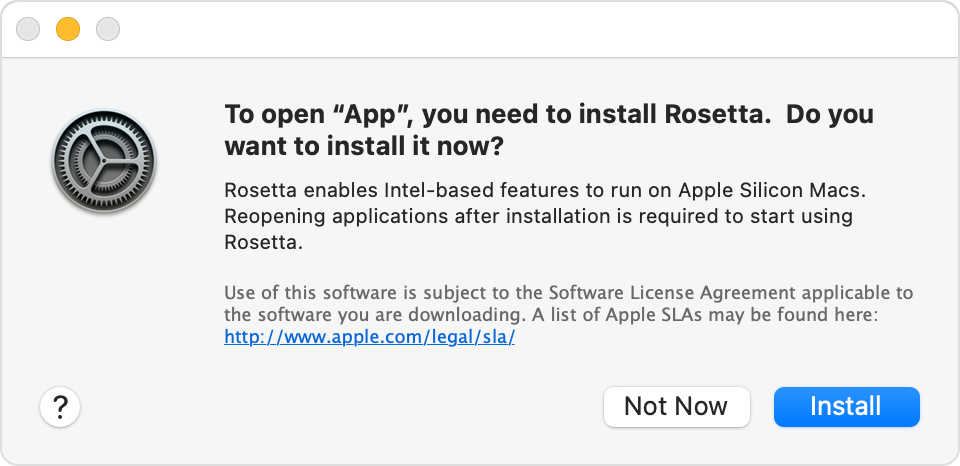
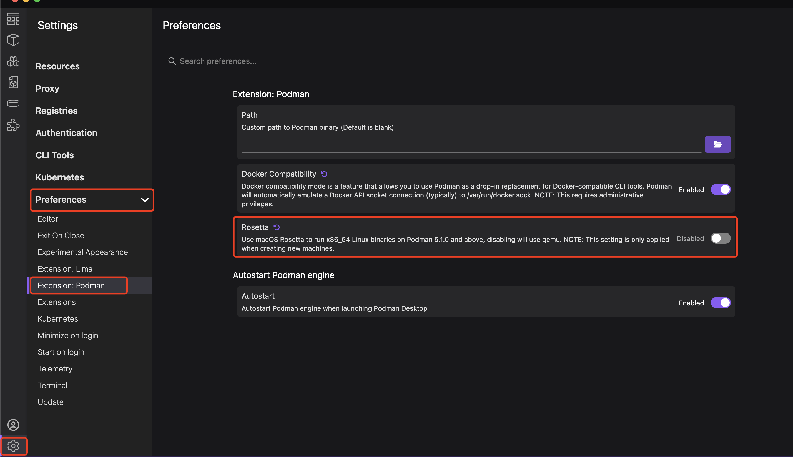

# 20240613_Podman 使用

## 1. 下载安装

[podman-desktop 下载地址](https://podman-desktop.io/downloads)
如果点不了，或者下载指定版本，可以 [Github](https://github.com/containers/podman-desktop/releases/tag/v1.13.2)下载。

也可以，但没有试过:

```bash
brew install podman
```

## 2. 虚拟机配置

### 2.1 初始化虚拟机

`Podman` 在 `Linux` 系统上安装好了就能直接用。但在 `macOS` 上还需要一个额外的虚拟机初始化步骤。
估计在原生的 `Windows` 上使用也是如此。

初始化 `Podman` 虚拟机的命令如下：

```bash
podman machine init
```

第一次执行会下载一个虚拟机的基础系统，系统是 `Fedora CoreOS`。

完成初始化虚拟机的步骤后，就可以正式使用 `podman` 命令了。

### 2.2 虚拟机设置

`Podman` 在这个系统中默认是以 `Rootless` 方式执行的，建议设置为 `Root` 模式，可以避免一些实际应用时的权限问题。切换模式的命令如下:

```bash
podman machine set --rootful
```

如果 `machine` 在 `running` 的情况下，需要先 `stop` 才能设置 `rootful` 模式。

```bash
podman machine stop
# Machine "podman-machine-default" stopped successfully
```

启动 `machine`:

```bash
podman machine start
# Starting machine "podman-machine-default"
# API forwarding listening on: /var/run/docker.sock
# Docker API clients default to this address. You do not need to set DOCKER_HOST.

# Machine "podman-machine-default" started successfully
```

### 2.3 M1 提示 start 失败

如果在 `start` 的时候，弹窗提示:



Mac 对此的解释:

- [If you need to install Rosetta on your Mac](https://support.apple.com/en-hk/102527)
- [如果你需要在 Mac 上安装 Rosetta](https://support.apple.com/zh-cn/102527)

若 `install` 一直没有反应，则需要手动关闭 `Rosetta`:



在 `M1` 芯片低版本 `Podman` 才会出现这个提示，试了下 `install Rosetta` 没有反应，后续步骤无法继续执行。
后面 `Podman` 版本升级后，这个提示已经没有了。

## 3. 配置镜像仓库源

如果终端有设置代理，则可以跳过这个步骤。

### 3.1 虚拟机配置：

```bash
podman machine ssh
```

配置文件:

```bash
sudo vi /etc/containers/registries.conf
```

追加配置内容:

```conf
### 取消从默认地址搜索的仓库域名
unqualified-search-registries = ["docker.io"]

# 自定义搜索器
[[registry]]
# 仓库前缀（镜像前缀）
prefix = "docker.io"
# 加速器地址，此处配置的 docker 中国区源
location = "x1dszur1.mirror.aliyuncs.com"
# 允许通过 http 协议获取镜像
insecure = true
```

这里的加速器地址, 为[阿里云镜像加速器](https://cr.console.aliyun.com/cn-beijing/instances/mirrors)。

`M1` 芯片配置这个，`search` 正常，但 `pull` 不成功：

```bash
# 设置 insecure = false 也不行
podman pull mysql
# Resolving "mysql" using unqualified-search registries (/etc/containers/registries.conf.d/999-podman-machine.conf)
# Trying to pull docker.io/library/mysql:latest...
# Error: initializing source docker://mysql:latest: pinging container registry x1dszur1.mirror.aliyuncs.com: StatusCode: 403, "This request is forbidden. Please proceed to https..."
```

### 3.2 重启虚拟机

```bash
podman machine stop
podman machine start
```

重启后，上面的配置才会生效。

### 3.3 验证是否生效

```bash
podman info
```

打印内容如下:

```yaml
# ...
registries:
    docker.io:
        Blocked: false
        Insecure: true
        Location: x1dszur1.mirror.aliyuncs.com
        MirrorByDigestOnly: false
        Mirrors: null
        Prefix: docker.io
        PullFromMirror: ''
    search:
        - docker.io
# ...
```

## 4. 登录 Registry

```bash
podman login docker.io
# Username: xxx@gmail.com
# Password:
# Login Succeeded!
```

重新执行，如果已登录：

```bash
podman login docker.io
# Authenticating with existing credentials for docker.io
# Existing credentials are valid. Already logged in to docker.io
```

## 5. 查找镜像

```bash
podman search mysql
# NAME                                     DESCRIPTION
# docker.io/library/mysql                  MySQL is a widely used, open-source relation...
```

## 6. 下载镜像

```bash
podman pull mysql:8
# Resolving "mysql" using unqualified-search registries (/etc/containers/registries.conf.d/999-podman-machine.conf)
# Trying to pull docker.io/library/mysql:8...
# Getting image source signatures
# Copying blob sha256:ac563158d7217088d06b716be9ea5131fe1ae47572467fbbdfb1031487b9957a
# ...
# Copying config sha256:3218b38490cec8d31976a40b92e09d61377359eab878db49f025e5d464367f3b
# Writing manifest to image destination
# 3218b38490cec8d31976a40b92e09d61377359eab878db49f025e5d464367f3b
```

## 启动镜像

```bash
podman run \
    -d \
    -p 3309:3306 \
    --name podman_mysql_80_we_low_code \
    -v /Users/[user]/MyFiles/Podman/podman_mysql_80_we_low_code/data:/var/lib/mysql \
    -v /Users/[user]/MyFiles/Podman/podman_mysql_80_we_low_code/mysql.conf.d/mysqld.cnf:/etc/mysql/mysql.conf.d/mysqld.cnf \
    -e MYSQL_ROOT_PASSWORD=root \
    docker.io/library/mysql:8
```

## 更多

解下来就可以验证是否可以正常访问 mysql 来验证是否正常了。
